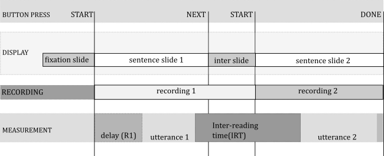

```{r setup, include=FALSE}
knitr::opts_chunk$set(
	echo = FALSE,
	fig.height = 3,
	message = FALSE,
	warning = FALSE
)
library(huxtable)
library(readr)
library(jsonlite)
library(dplyr)
library(knitr)
library(kableExtra)
```
# Methodology 
This section outlines the methodology employed for the reported study. The methodology outlined is referred to as the *Double Reading Procedure* and was first implemented by @fodor2019center. Participants are asked to read sentences twice, once without any previewed (cold reading or reading-1), and then again after unlimited preview (previewed reading or reading-2).

## Participants recruitment

The participants in this study were all undergraduate students at Queens College, CUNY, enrolled in Psychology 101. These students were required by the university to participant in studies for course credit. Self reported age ranged from 18 to 25 years. Participants were recruited using the Queens College Sona system, which is software designed for univeristy participant pools. Students saw the blurb in (@rec) and were able to schedule their own appointment time within the hours offered (Monday - Thursday, 10am to 4pm).

  (@rec)  **Recruitment**<br>
          You will be asked about your reading habits and then asked to read complex sentences out loud while being audio recorded. Recordings of your voice will be analyzed, but will be kept strictly confidential. The process will take no more than 1 hour. Note that the study takes place in Queens Hall, which is about half a mile from the main Queens campus. See directions on the QC website, URL below, for how to get here. The room is 335D, on the third floor. Entrance to the building is in the back. 

All participants were self identified native and primary speakers of American English. One participant was disqualified post-hoc, although still paid for time spent, after producing a Carribean English pronucnciation pattern. One other participant was excluded post-hoc due to an extremely disfluent reading cadence.

## Location

All data were collected in a private room of Queens Hall, Queens College with only the experimenter and participant present. While every effort was undertaken to ensure a quiet environment, intrusive noise from passersby or neighboring rooms were sometimes unavoidable. This resulted in some unusable or partially unusable recordings (discussed in section \@ref(results-irt) of the results chapter).

## Equipment and software

The experiemnt was presented on a laptop running Windows 10 with stickers on the keyboard labeling relevant keys. The left shift key was labeled *START*, right shift was labeled *NEXT*, and the touchpad was labeled *DONE*.

The presentation of items and instruction[^instr] was done using the Open Sesame software [@os2012] which provides both a graphical user interface, scripting language, and interpretation of Python code, for precise control of experimental presentation.

Recording was done using a Blue Yeti USB microphone position near the participant's left hand and angled to point at the space in front of the participant's mouth. The angle was adjusted for each participant's height. It recording 44.1kHz single-channel audio. Each recording was saved to the laptop's hard drive and also immediately uploaded to a Microsoft OneDrive account provided to the author by the Graduate Center, CUNY. No personally identifying information other than the quality of the participants' voices was embedded in the recordings. Only a handwritten ledger tied participants to the identifier used in the filename of the recordings.

[^instr]: Instructions were also provided verbally and via printout. Details on the instructions are available in the appendices \@ref(sec:instr).

## Procedure

Participants sat at a computer and used keyboard button presses to navigate the experimental presentation. They recieved thorough instructions and completed three practice items, the consulted with the experimenter, before beginning the main portion of the study. The study also contained 4 pseudo-practice items that were not included in any analyses, in order to allow some time for the participant to settle into the procedure before any results were recorded.

Each experimental item was preceeded by a screen showing a line of ten Xs with its left edge aligned with the left edge of the to-be-revealed sentence. This was intended to fix the participant's attention on the start of the sentence, and hopefully avoid unintended lookahead. This screen remained visible indefintely, until the participant pressed *START*.

Immediately after *START* was pressed, recording of the first reading began and the sentence appeared on the screen on a blue background. The recording continued and the screened remained visible until the participant pressed *NEXT*.After pressing *NEXT*, a screen appeared with instructions telling the participant that they were between readings, and needed to press *START* to reveal the sentence again and prepare for their second reading. Immediately after *START* was pressed, the first recording ended and the second recording began, and the sentence reappeared, this time on a green background.



The shifting of required key presses and the changing background color were intended to aid the participant in remember where they were in the process, and to prevent accidental double-presses of any given button from having unintended side effects. It took some time for the participants to adapt to the somewhat complicated procedure, but most seem to have gotten the hang of it before the first real item was presented.

### Instructions to participants {##inst}

Participants were given a verbal overview of the experimental procedure and then asked to read a one page printout of the procedure before signing a consent form. After signing a consent form, participants sat at the computer and were once again walked through instructions before the first practice item was presented.

## Materials

A number of considerations went into creating the materials for this study. The experimental stimuli are based on earlier pilot study exploring this same phenomenon [@qp2], but with several issues with that study's experimental items corrected.

One of these issues was that the verbs did not all strongly subcategorize for a PP-argument. This could affect the strength of the garden path effect, since the strength of that subcategorization might impact the amount of sway that the parsing strategy of *Minimal Attachment* or *Argument Preference* has on the parse. Theoretically, verbs with stronger subcategorization for a PP-argument would result in a stronger garden path effect, or more difficulty in understanding the sentence. 

Another issue had to do with the level of detail present in the sentences, especially when they were presented as yes/no-questions. When it’s clear that the speaker already knows so much about the situation, it becomes difficult to imagine a pragmatically plausible context where the question would be asked. Such sentences might be described as “prosecutorial[^dcb-prosec].” 

There was also an issue of whether the temporary ambiguity in some of the non-garden path items was ever fully disambiguated. This section will go over considerations taken in order to adjust the stimuli from the earlier study into more systematic and consistent format. The construction of these items is discussed in detail in the rest of this section.

[^dcb-prosec]: Thank you to Dianne Bradley for making this observation, and for the very clever “prosecutorial” descriptor.

### Four versions of the experimental items

The experimental items for this study consisted of 16 sentences in 4 versions: declarative and yes/no interrogative versions of both a PP-attachment garden path of the type discussion earlier, and a non-garden path control which is identical to the garden path up until the final PP, when that PP disambiguates the sentence such that the parse is plausible with a PP2 that modifies the head noun of PP1. The interrogative is always identical to the declarative in every way except for inversion of the order of the subject and auxiliary verb, and the replacement of a final period with a final question mark. An example item in all four versions is shown in \@ref(tab:sentences).

```{r sentences}
sentences <-cbind( 
  c(
    "Declarative non-garden path",
    "Interrogative non-garden path" ,
    "Declarative garden path",
    "Interrogative garden path"
  ), 
  c(
    "He had intended to cram the paperwork in the drawer of his filing cabinet.",
    "Had he intended to cram the paperwork in the drawer of his filing cabinet?",
    "He had intended to cram the paperwork in the drawer into his boss's desk.",
    "Had he intended to cram the paperwork in the drawer into his boss's desk?"
  )
)
colnames(sentences) <- c("Version","Sentence")
kable(sentences, booktabs=T, caption="Experimental item in four versions")
```

### Main verbs in experimental items

An earlier pilot study exploring this same phenomenon (Peckenpaugh, 2016) had several issues with its materials. One of these issues was that the verbs did not all strongly subcategorize for a PP-argument. This could affect the strength of the garden path effect, since the strength of that subcategorization might impact the amount of sway that the parsing strategy of Minimal Attachment or Argument Preference has on the parse. Theoretically, verbs with stronger subcategorization for a PP-argument would result in a strong garden path effect.


  (@weak) Weak PP-argument subcategorization (*hide*) 
  
  a. The gangsters had hidden the shotguns in a U-Haul truck in an old outhouse. 
  b. \checkmark The gangsters had hidden the shotguns.
            
  (@strong) Strong PP-argument subctategorization (*cram*) 
  
  a. Justin had crammed the old newspapers under the couch in a small wastebasket.
  b. \* Justin had crammed the old newspapers.


The examples in (@weak) and (@strong) point out that while you really must cram something somewhere, you don’t necessarily need to say where you hide something. That is, the verb *hide* seen in (@weak) does not strongly subcategorize for a locative argument (hence the acceptability of (@weak~\tiny ~b)), while cram (@strong) does, rendering (@strong~\tiny ~b) unacceptable. Because of the asymmetry in subcategorization strength, sentences like (@weak) might not trigger as strong a garden-path effect, because the parser might assume that no PP-argument is forthcoming, while for (@strong) the parser will jump at the opportunity to parse a PP as an argument.  In designing the items for this study, only verbs with strong PP-argument subcategorization will be used. The four verbs selected were: *cram*, *put*, *stick* and *set*.

### Complex tense

To minimize the morphology present on the PP-argument-selecting main verb (e.g. *cram*), each sentence contained a past-tense auxiliary verb and past participle verb before the infinitive version of the main verb. The use of an auxiliary makes the words present in the declarative exactly the same as in the interrogative by eliminating the need for "do-support" and adjusted morphology on the main verb (i.e. rather than "He crammed ..." vs. "Did he cram ...?" we have "He had crammed ..." vs. "Had he crammed ...?"). The auxiliary is always *had* and the past participle is always one of the following four: *decided*, *intended*, *wanted*, and *planned*. The presence of these preface verbs also help to aleviate the oddity of the yes/no questions, because it is understandable to question someone's intentions, even when a large amount of detail is already known; whereas, questioning the details themselves when they are already known leads to the "prosecutorial" issue mentioned earlier.

  (@lessPros) Had he planned to set the appetizers on the platter from his cousin?
  (@pros) Had he set the appetizers on the platter from his cousin?
  
It seems less odd to wonder whether *he had planned* to do something, as in (@lessPros) when we know so many details, rather than to wonder if he did as in (@pros). The preface verb also seems to attract the focus of the yes/no question, providing a somewhat controlled environment for what can be difficult to ascertain: in (@pros) the focus could be on any number of elements, with no easily assumed default. The default focus in (@lessPros) seems to me to be on *planned*.


### Prepositions and disambiguation

Every version of each experimental item should be fully disambiguated by the preposition heading the final PP. When PP2 attaches low, a preposition that is not compatable with being the resultative/locative argument of the verb but can be a modifier of the noun of the preceeding PP is used: *from* or *of*. When the final PP attaches high, a preposition that is not compatable with being a modifier of the noun in the preceeding PP but can be the resultative/locative argument of the verb is used: *into* or *onto*.

  (@low)  Had he planned to set the appetizers on [~NP~ the platter [~PP2~ *from* his cousin]]?
  (@high) Had he planned to set the appetizers on [~NP~ the platter] [~PP2~ *onto* the buffet]?
  
This clear disambiguation should prevent any lingering processing issues due to ambiguity in the non-garden path versions of the sentences.

### Fillers

There were 32 filler items that ranged in complexity. Half (16) were designed to end in a sequence of two PPs, to mirror the experimental item. The other half contained no final PPs. All fillers were designed in two versions: declarative and interrogative. A full list of fillers is available in \@ref(appendix-fillers). Fillers were not limited to the four main verbs of the experimental item, but did always follow the same pattern of *had* followed by a past participle. The past participle was always one of the four used for experimental item, or one of these additional four: *forgotten*, *remembered*, *wanted*

### Length

Length was tightly controlled across items. For experimental items, all sentences were between 66 and 75 characters long, and between 13 and 15 words long. The length never varied across the &plusmn;Q condition. Across the &plusmn;GP condition there was a maximum length difference of one character. Two items varied in word length across &plusmn; by one word. For all length variations (word and character), an equal number were longer in the +GP condition as in the -GP condition. They ranged from 18 to 22 syllables.

Control over filler length was slightly less stringent. They ranged from 63 to 79 characters and 12 to 14 words. 

## Experimental groups and order of items

No participant saw more than one version of each sentence, and each participant saw one version of every sentence. Each participant saw the same number of each type of sentence: 4 garden path declaratives, 4 garden path interrogatives, 4 non-garden path declaratives and 4 non-garden path interrogatives. The experimental item were presented in pseudo-random order, interspersed with 1 to 3 fillers and with two experimental items never occuring in the same version twice in a row (e.g. after declarative garden path, the next experimental item was never also a declarative garden path).

The four versions of the experimental sentences resulted in four groups. A split-half ordering (where the first 24 of the items presented to one group was the second 24 presented to the other) resulted in 2 versions for each group, and so there were 8 groups in total.

## Inter-reading time (IRT) measurement

Subjects were asked to read each sentence twice, once with no preview at all (reading 1, a cold reading), and then again after unlimited preview (reading 2, a previewed reading). Inter-reading time (IRT) is a measure of the amount of time between when a subject stops speaking after a cold reading and when they begin speaking for a previewed reading.

```{r metasetup}

## meta 
json <- read_file("../meta-4_11.json")
meta<-fromJSON(json)
handset <- read.csv("../csvs/_SITA_SET_VALUES.csv")
meta[meta$file %in% handset$Filename,]$agg <- NA
meta[meta$file %in% handset$Filename,]$hpf <- NA
hscount <- sum(handset$Filename %in% meta$file)
```
IRT was measured using a Python script and Google's WebRTC Voice Activity Detection (VAD) over 44.1kHz WAV files downsampled to 8kHz via SOX[^upsamp]. This VAD system uses Gaussian Mixture Models to make probabilistic decisions on whether a given audio frame is speech or noise (see [@gmm1] for a complete explanation). Google's implementation takes one paramater, which they call aggressiveness: a 4-tier setting for the level of confidence necessary to call a gvien frame speech. I call this "rejection rate", where a higher rejection rate means that the model requires a high level of confidence before assuming a frame is speech, i.e. it is more likely to label something noise than speech. The implementation codes this setting as 0-3, where 0 is the most lenient (most likely to label a frame as speech) and 3 is the most stringent (most likely to label a frame as noise).

[^upsamp]: Google's VAD API only accepts WAV files with sample rates that are a multiple of 8kHz. It ultimately downsamples all files to 8kHz, regardless of the input rate.

The recordngs vary in the volume of the speaker's voice and the amount of background noise present. An algorothm was constructed to allow for the most stringent measurement of the least modified data that gave plausible measurements. Specifically, each file was measured using the highest possible rejection rate for the VAD algorithm and no modification of the file. If the timings detected were not plausible, the timings were re-measured with the same rejection rate, but after the recording had undergone a 200Hz high-pass filter[^alg] (HPF). If that still failed, a 400Hz HPF was used. After a further failure, the rejection rate for the VAD was lowered, and the whole thing was tried again (0, 200Hz, 400Hz); and that process was itself repeated until the lowest possible rejection rate was tried of the four possible settings. 

Of the `r nrow(meta)` recordings subjected to this treatment, `r nrow(meta[meta$success & !is.na(meta$agg),])` resulted in plausible timings. For those that were successfull, the breakdown of HPF and rejection rate used is reported in Table \@ref(tab:metable). A further `r hscount` were set by hand, resulting in a total of `r nrow(meta[meta$success,])` recordings.

[^alg]: The exact algorithm is available on [github](https://gist.github.com/moui72/4ebc4eb8f69eb9fdb1cab160ce299675) (URL: [bit.ly/2uMrcrG](https://bit.ly/2uMrcrG))

```{r metable}
metaTable<-xtabs(~agg+hpf, meta[meta$success,])
row.names(metaTable)<-c("Lowest VAD rejection rate","...","...","Highest VAD rejection rate")
kable(
  metaTable, 
  col.names = c("No HPF", "HPF at 200Hz", "HPF at 400Hz"),
  caption="VAD rejection rate and HPF values",
  booktabs=T
) %>% kable_styling(latex_options = "hold_position")
```

A plausible set of measurements had to meet the following criteria:

*Utterance length:* An utterance length between 2s and 10s, where utterance timing is the longest contiguous span in the recording that VAD reports as phonation, with breaks in phonation of less than 1s not breaking contiguity.  @goldman1961-pa found that a large majority (82.5 to 87%) of pauses in fluent speech are less than 1s. Stimuli range from 18-22 syllables in length. If we assume a speeach rate of 3 to 7 syllables per second [@jacewicz2010-sr] we would expect utterances between 2.5s and 7.3s. Conservative thresholds higher and lower than the expected were used, especially on the higher end to allow for any processing or fluency.

*Minimum leading silence:* A leading silence ("delay") of more than 120ms. Even a very fast human reaction time should not permit a delay shorter than 120ms. 

*Maximum edge silence:* A maximum trailing and leading silence length of less than 95% of the file's length was also used, in order to filter out recordings that do not represent a valid trial. Very long delays less than this very conservative threshold are dealt with in the data clean up rather than via phonation detection.

## Prosodic judgements

A trained linguist informant naive to the research being conducted listened to recordings and reported the presence or absence of breaks in certain regions of the sentence, as well as several other judgements. She was instructed to familiarize herself with a speaker's speech patterns before rating any recordings by listening to 6 filler item recordings from that speaker. She was given a diagram of the sentences as in table \ref{tab:reg}, as well as full plain-text lists of all items.

```{r reg}
Sentence = c(
  "He", 
  "had", 
  "meant", 
  "to stick ||$_{V}$", 
  "the pencil case ||$_{OBJ}$", 
  "in the cabinet ||$_{PP1}$", 
  "into his book bag."
)
Syntax = c(
  "NP$_{SUBJ}$",
  "AUX", "V$_1$",
  "V$_2$", 
  "NP$_{OBJ}$",
  "PP$_1$", 
  "PP$_2$"
)

region = c("SUBJ", " ", "V", " ", "OBJ", "PP1", "PP2")
tab = rbind(Sentence,Syntax)
colnames(tab) <- region
kable(tab, booktab=T, caption="Sentence region labels", escape=F,row.names = F) %>% 
  kable_styling(latex_options = c("scale_down","hold_position"))

```

She was asked to report on whether or not she heard a prosodic boundary directly after the region labeled **V**, directly after the region labeled **OBJ**, and directly after the region labeled **PP1**. The following definition of prosodic break was provided:

>Please work with the assumption that “prosodic boundary” in what follows is any subset of the following features, clustered in such a way as to trigger your intuition that a new prosodic element (of any size) is beginning: pitch change, volume change, segmental lengthening, or pause.

The judgements requested also included whether or not the speaker struggled, where that struggle began, whether or not the speaker used question intonation, and which break(s) were stronger or more prominent than which other break(s). 

Detailed instructions on the order in which items should be listened to, both within speaker and across speakers, were also provided. The result was that she never listened to both readings of a sentence in sequence; she never listened to two reading 1 versions of different sentences in sequence; and she never listened to the sentences in the same order for a given participant as she did for the previous one.

Details on the instructions given and the judgements collected can be found in the appendices (\ref{sec:RA}).

### Reliability

A second trained linguist repeated the task over 128 recordings selected from 8 participants (two from each group, one per ordering). Even number experimental items were used from 4 participants, and odd numbered from the other 4. There were 8 recordings missing from the 128 selected, so the reliability task resulted in judgements over 120 recordings. The first informat also blindly re-rated those 120, with the recording name obscured and instructions not to revisit her original ratings. Reliability scores (percent of recordings agreed upon) are reported in table \ref{tab:validity}.

```{r validitySetup}
library(irr)
library(readr)
all <- read_csv2("export/prosody_validity.csv")
# columns to iterate
vals = c("V","OBJ","PP1","STRONG","WEAK","STRUG","STRUG_START","QI")
# raters to compare to main
suffixes=c("-dr","-sp")

# comps will hold string rep of Agr%, Kappa, (z) *pval*
comps <- matrix(nrow=2,ncol=length(vals),dimnames = list(suffixes))
colnames(comps)<-vals

# aggs will hold just agree%
aggs <- matrix(nrow=2,ncol=length(vals),dimnames = list(suffixes))
colnames(aggs)<-vals

# for each col...
for(val in vals) {
  # for each rater...
  for(suf in suffixes) {
    # d is 120 rows, 2 col, where col[1] = main, col[2] = suf rater
    d <- cbind(all[[paste0(val)]],all[[paste0(val,suf)]])
    a <-kappa2(d)
    ag <- agree(d)
    aggs[suf,val] <- paste0(ag$value,"%")
    comps[suf,val] <- sprintf(
      "%0.1f%s %0.2f%s <br> (z = %0.2f)",
      ag$value,
      "% <br> K = ",
      a$value,
      ifelse(a$p.value < 0.001,"***",
             ifelse(a$p.value < 0.01,"**",
                    ifelse(a$p.value < 0.05,"*",
                      ifelse(a$p.value < 0.1," .",
                             "")))),
      a$statistic
    )
  }
}

comps <- comps %>% as.data.frame()
row.names(comps) <- c("Interrater","Intrarater")
if(knitr::is_latex_output()){
  comps <- comps %>% mutate_all(linebreak)
}
```
```{r validity}
kable(
  comps,
  caption="Inter and intrarater agreement, Agreement percentage and Cohen's Kappa", 
  booktab=T, 
  digits=2,
  align="c",
  escape=knitr::is_latex_output(),
  col.names=c("V","OBJ","PP1","STRONGEST","WEAKEST","STRUGGLED","START REGION","FINAL RISE")
) %>%
  kable_styling(latex_options = c("hold_position","scale_down")) %>%
  add_header_above(c(" " = 1, "Breaks" = 3, "Break strength" = 2, "Struggle" = 2, " " = 1)) %>%
  footnote("*** p < 0.001; ** p < 0.01; * p < 0.05, . p < 0.1")
```

The lower intrarater agreement for relative break strength was likely a result of a methodological issue: it was possible to report the same pattern, e.g. a pattern where a PP1 break is stronger than an OBJ break, by either giving the response "PP1" for strongest break, and "OBJ" for weakest break; or, "PP1" for strongest and "NONE" for weakest; or, "NONE" for strongest and "OBJ" for weakest. While the instructions to the rater requested full verbosity, it's likely that inconsistencies occurred for these cases.

The same inconsistencies would have hurt interrater agreement for strongest/weakest also. A further contributing issue for interrater agreement of those two judgements stems from the poor agreement on the presence of the verb break. When the raters don't agree about the presence of a break, that disagreement is magnified for the judgement of the relative strength of breaks.

