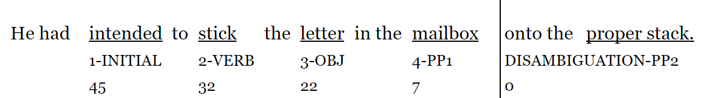

```{r setup, echo=F, warning=F, message=F}
knitr::opts_chunk$set(
	echo = FALSE,
	fig.height = 3,
	message = FALSE,
	warning = FALSE
)

library(readr)
library(jsonlite)
library(dplyr)
library(knitr)
library(kableExtra)
library(pander)

kable<-function (data,...){
  if(is_html_output() | is_latex_output()) {
    return (knitr::kable(data,...))
  } else {
    return (pander(data))
  }
}

```

# Methodology 

This section outlines the methodology employed for the reported study. The protocol outlined is referred to as the *Double Reading Procedure* and was first implemented by @fodor2019center. Under this protocol, participants are asked to read aloud visually presented sentences twice, once without taking any time to preview sentence content (Reading 1), and then again after unlimited preview (Reading 2).

@fodor2019center aimed to investigate the extent to which preview impacted the prosodic phrasing of center embedded sentences, as well as whether or not readers would find the doubly center embedded sentences more comprehensible after preview (or, comprehensible at all, as the doubly center embedded sentences often were not on first attempt). In the prosody literature up to this point, preview has largely been ignored as a factor in reading aloud tasks. @fodor2019center found that preview did indeed impact both the prosodic grouping that readers used and comprehensibility. 

While the questions being in the current study here are different, we are still concerned with the prosody that is produced, as well as the difficulty the reader experiences in parsing a sentence in order to read it aloud. This experimental paradigm eliminates the possible noise of not knowing whether a given pronunciation represents a considered or naive attempt to read a sentence aloud.

## Materials

In total there were 16 experimental items each constructed in 4 versions, and 32 fillers in two versions. The design decisions are discussed in detail in this section.

### Experimental items

```{r sentences}
sentences <-cbind( 
  c(
    "D Arg",
    "Q Arg",
    "D Mod",
    "Q Mod"
  ), 
  c(
    "He had intended to cram the paperwork in the drawer into his boss's desk.",
    "Had he intended to cram the paperwork in the drawer into his boss's desk?",
    "He had intended to cram the paperwork in the drawer of his filing cabinet.",
    "Had he intended to cram the paperwork in the drawer of his filing cabinet?"
  )
)
colnames(sentences) <- c("Version","Sentence")
t<-kable(
  sentences, 
  booktab=T, 
  caption="Illustrative experimental item, constructed in four versions"
)
if(is_html_output() || is_latex_output()){
  t %>% kable_styling(latex_options = c("HOLD_position"))
} else {
  t
}

```

The basic experimental items were created in a 2 x 2 design with one factor being speech act (interrogative/Q vs. declarative/D) and the other being PP2 status, i.e., PP2 was either a PP1 which must be an argument of the verb (Arg) or else one which can be a modifier (Mod) of the preceding phrase (PP1). A full list of experimental items is available in Appendix \@ref(appExp).

The experimental stimuli were based on earlier pilot study exploring this same phenomenon @qp2, with several adjustments made to accommodate the objectives of the current study. The sequence of parts for each of the basic items was always the same, shown in (@itemdiag).

  (@itemdiag) 
  

All four versions of any given quadruple used the same introductory material, the only difference arising through the necessary inversion of auxiliary and matrix subject, as required by the speech act factor. Across quadruples, subjects alternated between *she* and *he*, with half using one and half using the other; the auxiliary was always *had*. The matrix verb did not vary within a quadruple, but did vary between quadruples; for any given quadruple, the matrix verb was one of four verbs of mental state (*decide*, *intend*, *want*, or *plan*). 

The verb within the construction did not vary within a quadruple, but a given quadruple could have one of four verbs: *cram*, *put*, *stick* or *set.* The construction verb form was always infinitival. Each construction verb appeared in four different quadruples, and was paired once with each matrix verb, to create 16 unique pairings of matrix verb to construction verb. Thus, for matrix verb *decide*, for example, *decided to cram*, *decided to stick*, *decided to put*, and *decided to set*); and for construction verb *cram*, *decided to cram*, *intended to cram*, *wanted to cram*, and *planned to cram*). 

The word order and content of the construction was the same across all versions of a quadruple, with the exception of the content of PP2 which varied across the PP2-Status factor: The Arg versions of a quadruple had a PP2 which was headed by *into* or *onto*, while the Mod versions  had a PP2 which was headed by *of* or *from.* 

PP1 was the same across versions of a given quadruple, e.g., *cram the paperwork in the drawer...* (see Table \@ref(tab:sentences)'s illustrative example). That is, PP1 was temporarily ambiguous in every version of a given quadruple, being interpretable as either the goal argument of the construction verb or as a modifier of the object NP. However, in Arg versions of a quadruple, the argument interpretation of PP1 cannot be sustained once PP2 is encountered. In those cases PP2 must fill the goal argument slot and PP1 must be a modifier. The working assumptions about parsing discussed earlier, i.e., that the parser will initially assume PP1 to be the goal argument due to the primary status of arguments, assumes that Arg versions of a quadruple require reanalysis.  Between quadruples, the preposition that headed PP1 varied, but was always one which was compatible with it being a goal argument or a modifier of the object: *in* (8), *on* (7), and in one case, *under.* 

One benefit of using a complex verb cluster (auxiliary + matrix participle + infinitive) rather than a single verb[^aux] was that it isolated the differences across the versions of a quadruple triggered by the speech act factor to the left extremity of the introductory material of the sentence: only the position of the subject and the auxiliary were affected, meaning that the construction itself was completely untouched by this manipulation. 

[^aux]: Note that the use of an auxiliary also eliminates length differences across D vs. Q versions of a quadruple: if an auxiliary verb were not present, interrogative versions of a basic item would have an extra word, the result of so-called *do*-support, that would not appear in the declaratives (e.g., *he crammed* … vs. *did he cram* …?)

The purpose of including introductory matrix verbs was to reduce the oddity of the polar interrogative versions of each quadruple. It seems odd to ask, “Did Mary put the jelly beans in the window onto a fancy dish?” because, when it is clear that the speaker already knows so much about the situation, it becomes difficult to imagine a pragmatically plausible context where such a question would be asked. Such sentences might well be described as “prosecutorial[^dcbp].” Arguably, this is somewhat mitigated by the addition of a verb like *decided*: rather than asking about facts that we already seem to know, we are instead asking about an actor’s mental state with regard to those facts. Even if we know the facts of the situation, we do not necessarily know, for instance, whether it was the result of a decision, some third party’s action, or mere happenstance. Another adjustment made in order to make the polar interrogative versions of each quadruple more pragmatically acceptable limited the amount of detail in the experimental sentences, so that fewer adjectives and adverbs were included compared to the items employed in @qp2, and subjects were always third person nominative pronouns (*he* or *she*).

Importantly, the construction verb was always one which demanded a goal argument. Where some of the verbs used in the items employed by @qp2 only optionally took a goal, the current study used only verbs which require a goal argument. Verbs that optionally take a goal might result in a parse where PP1 is not immediately incorporated as the goal argument, which would mean that PP2 would not necessarily force reanalysis. Consider the contrasting sub-categorization of the verbs in (@optg) and (@oblg):

  (@optg) __Optional goal__ (*hide*) \linebreak
  The gangsters had hidden the shotguns in a U-Haul truck. \linebreak
  $\checkmark$ The gangsters had hidden the shotguns. \linebreak
  
  (@oblg) __Obligatory goal__ (*put*) \linebreak
  The gangsters had put the shotguns in a U-Haul truck. \linebreak
  $*$ The gangsters had put the shotguns. \linebreak

A verb like *hide*, as in (@optg), can take a goal, but can also be used without one. A verb like *put*, on the other hand, as in (@oblg), really must have a goal. The use of verbs that require a goal argument in the current study maximized the likelihood of a robust garden path effect in the Arg versions, when PP2 triggered reanalysis. The four construction verbs used in this study were: *cram*, *put*, *stick* and *set*.

Another important consideration was ensuring that the Arg versions had a PP2 which definitively disambiguated the attachment site of PP1 such that reanalysis was forced. In (@on), PP2 is implausible as a modifier of *rocking horse*, but not strictly impossible, and the sentence is grammatical with PP2 modifying it. On the other hand, the use of *onto* in (@onto) completely disallows the modifier interpretation of PP2 at the syntactic level: a PP headed by *onto* cannot grammatically modify the preceding NP.

  (@on) She had decided to put the child [~PP1~ on the rocking horse] [~PP2~ on the see-saw].
  (@onto) She had decided to put the child [~PP1~ on the rocking horse] [~PP2~ onto the see-saw].

Where @qp2 relied on plausibility to force reanalysis, the current study uses syntactic disambiguation, such that the Arg versions always have a PP2 headed by *into* or *onto* which cannot head a PP2 that modifies the NP of PP1. This avoids any noise that might result from discrepancies between individuals’ real world knowledge or beliefs. For the Mod items, the head preposition of PP2 was always either *from* or *of*, which are compatible with a parse where PP1 is the goal argument and PP2 is modifying the NP within PP1. 

It is worth noting that some linguists (e.g. @den2006relators) believe *of* is not a preposition in the same sense as *from*, *on*, or *in*, etc., in that it appears to be serving a strictly grammatical or functional purpose, without real lexical content. Importantly, it is also only 2 characters, whereas *into*, *onto*, and *from* (the other possible heads of PP2) are all 4 characters. This is revisited and its possible impact is explored in the results section (section \@ref(pp2h)).

To sum up, the experimental items were designed to have limited detail, with either *he* or *she* as the matrix subject. A complex verb cluster, e.g., *had decided to cram* was used to facilitate subject-auxiliary inversion without *do*-support in the interrogatives and limit the difference between items, as well as provide a verb of mental state (*decided*, *intended*, *wanted*, or *planned*) to support more pragmatically plausible questions. PP1 was always interpretable as either the goal argument or a modifier of the object. PP2 differed across the PP2-Status factor, but not across the speech act factor. In the two Arg versions of a quadruple, it was headed by *into* or *onto* and was intended to force reanalysis, under the assumption that PP1 had been incorporated into the parse as an argument, since a PP headed by *into* or *onto* must be interpreted as the goal argument, the position that PP1 would have presumably been occupying in the ongoing parse. For the two Mod versions of a quadruple, PP2 was headed by *from* or *of* and therefore was not expected to require reanalysis, as *from*- and *of*-headed PPs can attach as modifiers of a preceding NP (in this case, the NP within PP1), allowing PP1 to stay in the goal argument slot.

[^dcbp]: Thank you to Dr. Dianne Bradley for making this observation, and for the very clever “prosecutorial” descriptor.

### Fillers

There were 32 filler items that ranged in complexity: [[TODO some were ordinary sentences, some contained center embedding, and others included attachment ambiguities]]. Of these 32, 16 were designed to end in a sequence of two PPs, to mirror the experimental items (+PP), while the other half contained no final PPs (-PP). The +PP fillers were unrelated to the -PP fillers. All fillers were designed in two versions: declarative (D) and interrogative (Q). A full list of fillers is available in Appendix \@ref(appFill).


```{r fsentences}
sentences <-cbind( 
  c(
    "D +PP",
    "Q +PP" ,
    "D -PP",
    "Q -PP"
  ), 
  c(
    "He had forgotten to try the famous pastry in the restaurant of the fancy hotel.",
    "Had he forgotten to try the famous pastry in the restaurant of the fancy hotel?",
    "She had forgotten to report that the clerk was ignoring her request.",
    "Had she forgotten to report that the clerk was ignoring her request?"
  )
)
colnames(sentences) <- c("Version","Sentence")
t<-kable(
  sentences, 
  booktab=T, 
  caption="Illustrative filler items, constructed in two versions",
  linesep=c("","\\addlinespace")
) 
if(is_html_output() || is_latex_output()){
  t %>%
    row_spec(2, hline_after = T) %>%
    kable_styling(latex_options = c("hold_position"))
}else{
  t
}
```

All filler items had the same sort of introductory material as the experimental items (*he/she* + *had* + past participle verb of mental state). The past participle was either one of the four mental state used for the experimental items (*decide*, *intend*, *plan*, and *want*), or one four additional verbs of mental state: *forgot*, *mean*, *need*, or *remember*, with each of the 8 past participles being used twice in the +PP fillers and twice in the -PP fillers, for a total of 4 times each. This means that a participant would see 6 instances each of *decide*, *intend*, *plan*, and *want*, but only 4 instances of the filler-only mental state verbs. Fillers used both mental state verbs from the experimental items as well as others was to prevent the experimental items as being identifiable by which mental state verb was used, and to avoid extreme amounts of repetition for any given lexical item.

### Length

Length was tightly controlled across items. For experimental quadruples, all sentences were between 66 and 75 characters long, and between 13 and 15 words long. The length within a quadruple never varied across the D vs. Q factor. Across the PP2-Status factor, given that the content of PP2 differed within a given quadruple, there was a maximum length difference of one character. Two quadruples varied in word length across  PP2-Status by one word. Across all quadruples an equal number were longer (word- and character-wise) in the Arg condition as in the Mod condition. The experimental items ranged from 18 to 22 syllables.

Control over filler pair length was slightly less stringent. They ranged from 63 to 79 characters and 12 to 14 words. Length was never different within a filler pair, since only the speech act factor was implemented in the construction of fillers.

## Participants recruitment

All participants in the were undergraduate students enrolled at Queens College in Psychology 101[^irb] who participated for course credit. Self-reported age ranged from 18 to 25 years. Participants were recruited a software system designed for university participant pools. Students saw a recruitment notice on the system website (see Appendix \@ref(rec)), and were able to schedule their own appointment time within the hours offered.

The 35 participants recruited were self-identified native and primary speakers of American English. One participant was disqualified post-hoc after producing a Caribbean English pronunciation pattern; one further participant was excluded post-hoc due to an extremely disfluent reading cadence. A final participant was excluded due to a technical issue. All excluded participants were still awarded class credit for participating.

[^irb]: IRB approval number: 2018-0072

## Location

All data were collected in a private room with only the experimenter and participant present. While every effort was undertaken to ensure a quiet environment, intrusive noise from passersby or neighboring rooms were sometimes unavoidable. This resulted in some unusable or partially unusable recordings (detailed in section \@ref(irtDis) of the results chapter).

## Equipment and software

The experiment was presented on a laptop running Windows 10 with stickers on the keyboard labeling relevant keys: the left shift key was labeled *START*, right shift was labeled *NEXT*, and the touch-pad was labeled *DONE*.

The presentation of items and instruction[^instr] was done using the Open Sesame software [@os2012] which provides a graphical user interface, scripting language, and interpretation of Python code. The system was capable of 10-20 millisecond accuracy, with the display's 60Hz refresh rate being the limiting factor. Key input had a latency of about 10ms.

Recording used a Blue Yeti USB microphone position near the participant's left hand and angled to point at the space in front of the participant's mouth. The angle was adjusted for each participant's height. Audio was recorded at 44.1kHz single-channel quality.

[^instr]: Instructions were also provided verbally and via printout, see Appendix \@ref(instr).

## Versions of the experiment

The experiment was presented in 4 basic versions, with split-half ordering  (where the first 24 of the items presented to one group was the second 24 presented to the other) for a total of 8 groups. Each version contained 7 practice items, 3 of which were overt practice and 4 of which were covert practice, as well as one version of each of the 16 experimental and 32 filler items. No version contained more than one version of a given experimental quadruple, or a given filler pair, and each version contained one member of every experimental quadruple and filler pair. Each participant saw the same number of each type of experimental quadruple: 4 D Arg, 4 Q Arg, 4 D Mod and 4 Q Mod. The experimental items were presented in pseudo-random order, interspersed with 1 to 3 fillers. Ignoring fillers, the same version of a different quadruple never occurred in sequence (e.g., after encountering a D Arg, the next experimental item was never another D Arg).

## Procedure

Participants were given a verbal overview of the experimental procedure and then asked to read a one page printout of the procedure before signing a consent form. After signing a consent form, participants sat at the computer and were once again walked through instructions before the first practice item was presented.

Participants sat at a computer and used keyboard button presses to navigate the experimental presentation. They received thorough instructions and completed three practice items, then consulted with the experimenter before beginning the main portion of the study. The study also contained 4 covert practice items that were not included in any analyses, in order to allow some time for the participant to settle into the procedure before any results were recorded.

Each experimental item was preceded by a screen showing a line of ten Xes with its left edge aligned with the left edge of the to-be-revealed sentence. This was designed the participant's attention on the start of the sentence, and hopefully avoid unintended look-ahead. The issue of potential look-ahead is discussed at greater length in section \@ref(look-ahead).

The fixation screen remained visible indefinitely, until the participant pressed *START*.

After *START* was pressed, recording of the first reading began and the sentence appeared on the screen in black font on a light blue background. The recording continued and the screened remained visible until the participant pressed *NEXT*. After pressing *NEXT*, a screen appeared with instructions telling the participant that they were between readings, and needed to press *START* to reveal the sentence again and prepare for their second reading. Immediately after *START* was pressed, the first recording ended and the second recording began, and the sentence reappeared, this time on a light green background. There were never any linebreaks in item display.


The shifting of required key presses and the changing background color were intended to aid the participant in remember where they were in the process, and to prevent accidental double-presses of any given button from having unintended side effects. It took some time for the participants to adapt to the procedure, but generally the necessary habits were acquired before the first item of the experiment proper was presented.

### On look-ahead {#look-ahead}

An advantage that the Double Reading Procedure has is that it allows for certain assumptions to be made about Reading 2 that otherwise would be unclear: Reading 2 certainly represents a *considered* reading of the sentence. Not only has the reader had ample time to examine the sentence, but has necessarily read it and heard it read in producing Reading 1. This means Reading 2 can plausibly be thought to represent a considered prosodic structure, at least more so than an entirely naive reading, and should not reflect any processing issues; a parse should have already been devloped during Reading 1, or during subsequent study of the sentence prior to Reading 2.

The nature of Reading 1 is less clear. Because there is variability in the delay between the display of the sentence and the onset of phonation, it is possible that Reading 1 is not entirely delievered without preview. The properties of these Reading 1 delays are discussed at length in a later section, but for now it suffices to say that the very limited preview is possible during a delay that typically falls in the 0.2 to 2.7s range (median = 1s, SD = 0.4). As an example of common reading rates, @ashby2012eye reported faster readers as averaging 328 words per minute (wpm), and slower readers 228wpm, in silent reading. That study found that reading time is slower for reading aloud, and that the availability of parafoveal information (i.e., the difference between 1 word and 3 word windows) is less impactful for that reading mode. Given that the experimental items range from 13 to 15 words, most of the R1 delays would not allow even a fast reader to read the entire sentence: the median 1s R1 delay would allow a fast reader time to read very few words; keep in mind that the window is even shorter, because in addition to just reading, the subject is also handling several other cognitive processes (e.g., visual processing, lexical access, issuing motor commands, etc.). The utterance of Reading 1 should, therefore, contain within it any behavioral reflex of whatever parsing difficult the reader has, for most recordings.

In order to clearly understand the results of this double reading study, it is important to understand the mechanics of reading. Specifically, we would want to know at what point during the reading of a temporarily ambiguous sentence the participant will become aware of the existence of a disambiguating PP2, since this is when it will be realized that the initial parse may well crash. The work of several decades on this subject is thoroughly summarized in @rayner2012psychology. They describe reading as consisting of a series of fixations, when foveal vision takes in a small region of the visuaul field, and saccades, where the eyes move ahead ballistically (i.e., on a planned trajectory that cannot be interrupted). As a consequence of the ballistic property of saccadic movement and the additional finding that landing sites (fixations) are not random, we can infer that at least some look-ahead is available, i.e., a reader must know something about what is coming in order to plan a suitable landing site. The primary predictor of fixation point seems to be the character length of a word, meaning that the presence of characters and word boundary information (represented orthographically by spaces in languages like English) at least are necessary at the periphery of attention, i.e., within the perceptual span. Some details on the perceptual span, or the information that can be accessed by the eyes at any given time, is discussed in brief, with special attention to its relevance for the study at hand.

@rayner2012psychology discuss a number of studies that explore the size and properties of this span, the most fruitful of those studyes being based on a gaze-contingent moving-window technique. In this technique, text is presented on a video monitor while the reader is also hooked up to eye-tracking equipment. A computer constantly samples the position of the reader’s eyes and updates the display accordingly. Using this elaborate system, and the mutilation of text outside a window of clear text, a so-called moving window around the reader’s point of fixation is created. By manipulating the size of this window, it was found that reading speed is maximized when about 15 characters to either side of the fixation site is available (it turns out this is actually asymmetric, and the window need only go as far as the start of currently fixated word in the direction of what has already been read, i.e., to the left for English readers). 

In order to determine what information was available at the periphery of the perceptual span, the amount of information outside a window of clear text known to be smaller than the ideal (e.g., 21 characters, 10 to either side) was manipulated. When all characters and spaces were replaced with *X*, essentially destroying all information outside the window, reading was slower than when character spaces were maintained, but all other information was obscured. Improvements in reading speed also occured when characters were replaced with characters that had similar shape (i.e., the same pattern of ascenders and descenders) as the character they replaced, with and without spaces. Using these techniques and manipulating the size of the window, they were able to determine that it is only word boundary information that is available at the extreme edge of the perceptual span; character shape (ascenders and descenders) is available about 10 characters out from the fixation point, and character identity is available more or less only for the fixated word.

The relevant question for the study at hand is as follows: how much of the sentence will the reader have seen and processed when a given word is being spoken? A typical item is displayed in (@dtc), with the words expected to be fixated underlined, numbered by presumed fixation sequence, and labeled. The number of characters (including spaces) intervening before the start of the disambiguating region (the left edge of PP2) is displayed below each label. These counts are calculated from the initial character of the fixated word to the initial character of the disambiguating region; the actual fixation site is likely to be closer to the center of the word, meaning the distance would be shortened by a few (1-4) characters, depending on the length of the fixated word.

  (@dtc) 
  
  
Table \@ref(tab:dtcs) describes these distances across items all experimental items. Note that these values do not vary across condition, because counting starts after both the subject and auxiliary verb, and ends before PP2, and the only changes across versions are subject-auxiliary inversion and the content of PP2. 

```{r dtcs}
csv <- '
Median,46,34.5,25.5,7.5
Maximum,50,38,27,9
Minimum,45,32,21,5
'

tab <- read_csv(csv, col_names = F)

t<-tab %>% kable(
  col.names = c(" ","1-INITIAL","2-VERB","3-OBJ","4-PP1"),
  align="rccc", 
  caption="Distance in characters from fixation to disambiguation in experimental items",
  booktab = T
) 
if(is_html_output() || is_latex_output()){
  t %>% 
    kable_styling(latex_options = "hold_position")
}else{
  t
}
```

From the initial fixation point, the distance to disambiguation ranges from 45 to 50 characters, with a median of 46 characters.  If we recall that word boundary information is available 15 to 18 characters to the right of fixation, we can be certain that the disambiguating region is far out of view until several fixations in.

When does the reader become aware of the existence of PP2? When fixated on the direct object head noun, the range of distance is 21 to 27 characters, with a median of 25.5: PP2's content is still outside of view, even in the case of the smallest distance, and adjusting it to be a few characters smaller to account for the fact that fixation is likely to occur closer to the center of a word rather than on its first character. At most, the presence of the first few characters of PP2’s preposition may be available, but certainly not the character space after it. The distance from the PP1 fixation point (the head noun within that PP) ranges from 5 to 9 characters, with a median between 7 and 8 characters. Thus, we can say with some certainty that the reader of a sentence such as (@dtc) will be aware that another phrase, one which starts with a 4-character word, remains to be incorporated into the parse sometime after processing of the direct object, and before processing of PP1.

There is yet another piece to consider: the so-called eye-voice span (EVS), and the fact that the readers in this study are reading aloud rather than silently. According to @evs, when reading aloud the voice is typically behind the eyes by some 10-20 characters (M = 16.2 characters, SD = 5.2 characters). Adjusting Table \@ref(tab:dtcs) by subtracting 16 from each cell, we can approximate the position of the voice when the disambiguating region comes within the perceptual span. These values are shown in Table \@ref(tab:evsdtcr).


```{r evsdtcr}
csv <- '
Median,30,18.5,9.5,-8.5
Maximum,34,22,11,-7
Minimum,29,16,5,-11
'

tab <- read_csv(csv, col_names = F)

t<-tab %>% kable(
  col.names = c(" ","1-INITIAL","2-CONSTRUCTION VERB","3-OBJ","4-PP1"),
  align="rccc", 
  caption="EVS-adjusted character distance to disambiguation in experimental items",
  booktab=T
)

if(is_html_output() || is_latex_output()){
  t %>% 
    kable_styling(latex_options = "hold_position")
}else{
  t
}
```

It is likely, then, an oral reader's voice would actually still be on the object when the eyes' fixation begins to provide information of some kind about the existence of PP2, and will still be pronouncing PP1 when the eyes are first fixated on PP2. This raises a question about any prosodic breaks produced after the object, because it is difficult to distinguish between an intentional prosodic break at that point, and one arising from the reader using a natural break for hesitation related to the garden path effect of discovering the disambiguating PP2.

## Inter-reading time (IRT) measurement {#method-irt}

Subjects were asked to read each sentence twice, once with no preview at all (Reading 1), and then again after unlimited preview (Reading 2). Inter-reading time (IRT) is a measure of the amount of time between when a participant stops speaking after a cold reading and when speaking resumes for a previewed reading.

```{r metasetup}

## meta 
json <- read_file("../meta-4_11.json")
meta<-fromJSON(json)
handset <- read.csv("../csvs/_SITA_SET_VALUES.csv")
meta[meta$file %in% handset$Filename,]$agg <- NA
meta[meta$file %in% handset$Filename,]$hpf <- NA
meta<-cbind("P"=read.table(text=meta$file, sep=".")[[1]],meta)
hscount <- sum(handset$Filename %in% meta$file)
meta<-subset(meta,P != 8)
```

IRT was measured using a Python script and Google's WebRTC Voice Activity Detection (VAD) over 44.1kHz WAV files down-sampled to 8kHz via SOX[^upsamp]. This VAD system uses Gaussian Mixture Models to make probabilistic decisions as to whether a given audio frame is speech or noise (see @gmm1 for a complete description). Google's implementation takes one parameter, which they call aggressiveness: a 4-tier setting for the level of confidence necessary to call a given frame speech. I call this "rejection rate", where a higher rejection rate means that the model requires a high level of confidence before assuming a frame is speech, i.e., it is more likely to label something noise than speech. The implementation codes this setting as 0-3, where 0 is the most lenient (most likely to label a frame as speech) and 3 is the most stringent (most likely to label a frame as noise).

[^upsamp]: Google's VAD API only accepts WAV files with sample rates that are a multiple of 8kHz. It ultimately down-samples all files to 8kHz, regardless of the input sampling rate.

The recordings vary in the volume of the speaker's voice and the amount of background noise present. An algorithm was constructed to allow for the most stringent measurement of the least modified data that gave plausible measurements. Specifically, each file was measured using the highest possible rejection rate for the VAD algorithm and no modification of the file. If the timings detected were not plausible, the timings were re-measured with the same rejection rate, but after the recording had undergone a 200Hz high-pass filter[^alg] (HPF). If that still failed, a 400Hz HPF was used. After a further failure, the rejection rate for the VAD was lowered, with each HPF value tried again (0, 200Hz, 400Hz); and that process was itself repeated until the lowest possible rejection rate was tried of the four possible settings. 

A plausible set of measurements was required to meet the following criteria:

*Utterance length:* An utterance length between 2s and 10s, where utterance timing is the longest contiguous span in the recording that VAD reports as phonation, with breaks in phonation of less than 1s not breaking contiguity, as @goldman1961-pa found that a large majority (82.5 to 87%) of pauses in fluent speech are less than 1s. Stimuli range from 18-22 syllables in length. If we assume a speech rate of 3 to 7 syllables per second [@jacewicz2010-sr] we would expect utterances between 2.5s and 7.3s. Conservative thresholds higher and lower than the expected were used, especially on the higher end, to allow for any difficulties processing or fluency that might have lead to longer reading times.

*Minimum leading silence:* A leading silence ("delay") of more than 120ms. Even a very fast human reaction time should not permit a delay shorter than 120ms, so a shorter delay likely means an inaccurate set of measurements has been reported.

*Maximum edge silence:* A maximum trailing and leading silence length of less than 95% of the file's length was also used, in order to filter out recordings that do not represent a valid trial. Very long silences less than this very conservative threshold that impact the IRT are dealt with in the data clean-up rather than via phonation detection, as described in the results section of this paper (section \@ref(irtDis)).

With 32 participants reading 48 items (experimental and filler) twice each, there are an expected number of `r 32*48*2` recordings; due to technical issues at the time of data collection, `r 32*48*2 - nrow(meta)` recordings are missing. Of the `r nrow(meta)` recordings subjected to this treatment, `r nrow(meta[meta$success & !is.na(meta$agg),])` resulted in plausible timings[^handset]. A review of those that did not result in plausible timings found 9 recordings that were too noisy for computer analysis, but still usable, and those timings were recorded by hand.

[^alg]: The exact algorithm is available on [github](https://gist.github.com/moui72/4ebc4eb8f69eb9fdb1cab160ce299675) (URL: [bit.ly/2uMrcrG](https://bit.ly/2uMrcrG))

To verify the accuracy of the computer measurement, timings were collected by hand for `r 120*2` recording. There was a significant positive correlation between hand-measured and computer-measured timings (r(118)=0.87, p < 0.001), with a median difference of 0.4s[^error] (SD = 1.5).

[^error]: Hand measurement was done to the nearest half second, so a fair amount of error is to be expected.

## Prosodic judgments {#sita}

A trained linguist informant naive to the research being conducted listened to recordings and reported the presence or absence of breaks in certain regions of the sentence, as well as several other judgments. She was instructed to familiarize herself with a speaker's speech patterns before rating any recordings by listening to 6 filler item recordings from that speaker. She was given a diagram of the sentences as in Table \@ref(tab:reg), as well as full plain-text lists of all items.

```{r reg}
Sentence = c(
  "He", 
  "had", 
  "meant", 
  "to stick ||$_{V}$", 
  "the pencil case ||$_{OBJ}$", 
  "in the cabinet ||$_{PP1}$", 
  "into his book bag."
)
Syntax = c(
  "NP$_{SUBJ}$",
  "AUX", "V$_1$",
  "V$_2$", 
  "NP$_{OBJ}$",
  "PP$_1$", 
  "PP$_2$"
)

region = c("SUBJ", " ", "V", " ", "OBJ", "PP1", "PP2")
tab = rbind(Sentence,Syntax)
colnames(tab) <- region
t<-kable(tab, booktab=T, caption="Sentence region labels", escape=F,row.names = F) 
if(is_html_output() || is_latex_output()){
  t %>% 
    kable_styling(latex_options = c("scale_down","hold_position"))
}else{
  t
}

```

She was asked to report on whether or not she heard a prosodic boundary directly after the region labeled **V**, directly after the region labeled **OBJ**, and directly after the region labeled **PP1**. The following definition of prosodic break was provided:

>Please work with the assumption that “prosodic boundary” in what follows is any subset of the following features, clustered in such a way as to trigger your intuition that a new prosodic element (of any size) is beginning: pitch change, volume change, segmental lengthening, or pause.

The judgments requested also included whether or not the speaker struggled, where that struggle began, whether or not the speaker used question intonation, and which break(s) were stronger or more prominent than which other break(s). 

Detailed instructions on the order in which items should be listened to, both within speaker and across speakers, were also provided. The result was that she never listened to both readings of a sentence in sequence; she never listened to two reading 1 versions of different sentences in sequence; and she never listened to the sentences in the same order for a given participant as she did for the previous one.

Details on the instructions given and the judgments collected can be found in Appendix \@ref(RA).

### Reliability

A second trained linguist repeated the task over 120 recordings selected from 8 participants (two from each group, one per ordering). Even number experimental items were used from 4 participants, and odd numbered from the other 4. There were 8 recordings missing from the 128 selected, so the reliability task resulted in judgments over 120 recordings. The first informant also blindly re-rated those 120, with the recording name obscured and instructions not to revisit her original ratings. Reliability scores (percent of recordings agreed upon) are reported in Table \@ref(tab:validity).

```{r validitySetup}
library(irr)
library(readr)
all <- read_csv2("export/prosody_validity.csv")
# columns to iterate
vals = c("V","OBJ","PP1","STRONG","WEAK","STRUG","STRUG_START","QI")
# raters to compare to main
suffixes=c("-dr","-sp")

# comps will hold string rep of Agr%, Kappa, (z) *pval*
comps <- matrix(nrow=6,ncol=length(vals))
colnames(comps)<-vals

# aggs will hold just agree%
aggs <- matrix(nrow=2,ncol=length(vals),dimnames = list(suffixes))
colnames(aggs)<-vals

# for each col...
for(val in vals) {
  # for each rater...
  sufn = 0
  for(suf in suffixes) {
    row = 3 * sufn + 1
    sufn = sufn + 1
    # d is 120 rows, 2 col, where col[1] = main, col[2] = suf rater
    d <- cbind(all[[paste0(val)]],all[[paste0(val,suf)]])
    a <-kappa2(d)
    ag <- agree(d)
    aggs[suf,val] <- paste0(ag$value,"%")
    
    comps[row,val] <- sprintf(
      "%0.1f%%",
      ag$value
    )
    comps[row+1,val] <- sprintf(
      "K = %0.2f%s",
      a$value,
      ifelse(a$p.value < 0.001,"***",
             ifelse(a$p.value < 0.01,"**",
                    ifelse(a$p.value < 0.05,"*",
                      ifelse(a$p.value < 0.1," .",
                             "")))))
    comps[row+2,val] <- sprintf(
      "(z = %0.2f)",
      a$statistic
    )
    
    # comps[suf,val] <- sprintf(
    #   "%0.1f%s %0.2f%s <br> (z = %0.2f)",
    #   ag$value,
    #   "% <br> K = ",
    #   a$value,
    #   ifelse(a$p.value < 0.001,"***",
    #          ifelse(a$p.value < 0.01,"**",
    #                 ifelse(a$p.value < 0.05,"*",
    #                   ifelse(a$p.value < 0.1," .",
    #                          "")))),
    #   a$statistic
    # )
  }
}

comps <- comps %>% as.data.frame()
labels <- matrix(c(rep("Inter-rater",3),rep("Intra-rater",3)))
comps <- cbind(labels,comps)
```

```{r validity}
t<-kable(
  comps[,c(1,3:5)],
  caption="Inter and intra-rater agreement", 
  booktab=T, 
  digits=2,
  align="c",
  escape=knitr::is_latex_output(),
  col.names=c(" ","OBJ","PP1","Break strength")
) 
if(is_html_output() || is_latex_output()){
  t %>%
    kable_styling(latex_options = c("hold_position")) %>%
    column_spec(1, bold = T) %>%
    row_spec(c(1:2,4:5), hline_after = F) %>%
    collapse_rows(columns = 1, latex_hline = "major")  %>%
    footnote("*** p < 0.001; ** p < 0.01; * p < 0.05, . p < 0.1") 
}else{
  t
}
```

The lower intra-rater agreement for relative break strength was likely impacted by the method of reporting: because the informant was actually asked to provide judgements over three break locations (the third, V, is omitted throughout this report because it was extremely rare, occuring in just over 8% of recordings). As such, disagreement on that break and the fact that break strength is actually a compilation of two judgements (weakest and strongest break) amplified the noise to some extent.

