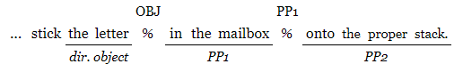
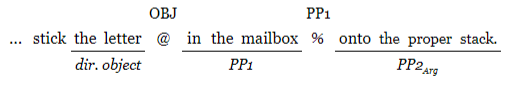
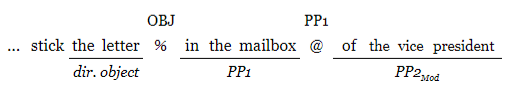

```{r results, echo=F, warning=F,message=F}
library(ggplot2)
library(ggthemes)
library(extrafont)
library(psych)
library(Cairo)

loadfonts("pdf")
knitr::opts_chunk$set(
  echo=FALSE, 
  warning=FALSE, 
  message=FALSE, 
  error = F,
  fig.height = 3, 
  fig.pos="H"
)

bgcolor <- "#ffffff"
par(bg = bgcolor)

kable <- function(...) {
  knitr::kable(booktab = TRUE,...)
}

### global plot themeing
theme_set(
  theme_tufte(base_size = 12) + 
    theme(
      plot.background = element_rect(fill = bgcolor,color=bgcolor),
      panel.border = element_blank()
    )
)

# sentence type order
sto <- function (SentenceType) {
  ifelse(SentenceType %in% c("D Arg", "Q Arg", "D Mod", "Q Mod"),
    return(
      ifelse(
        SentenceType=="Q Arg",
        length(SentenceType),
        ifelse(
          SentenceType=="D Arg",
          length(SentenceType)-1,
          ifelse(
            SentenceType=="Q Mod",
            length(SentenceType)-2,
            length(SentenceType)-3
          )
        )
      )
    ),
    return(1)
  )
}

```
# Results and discussion

This section reports various descriptions and analyses of the recordings obtained, and the relevance of those findings to the research questions motivating this study. The reported results include the effect of Speech Act (declarative/D vs. interrogative/Q) and PP2 Status (argument/Arg vs. modifier/Mod) on the location of prosodic breaks, as well as on time spent reflecting upon a sentence between readings, which I call inter-reading time (IRT). In order to evaluate the extent to which participants adhered to the protocol as intended, i.e., began to read immediately for Reading 1 as opposed to producing a considered reading in Reading 2, the delay for which a sentence is displayed before a participant begins to read it is compared for Reading 1  (R1 delay) vs. Reading 2 (R2 delay). The prosodic patterns for participants with especially fast and especially slow R1 delays are presented as a way of investigating the extent to which individual differences might impact those patterns, and as a further exploration of the success of the protocol instructions in producing the intended behavior. A finding on the apparent processing cost of interrogative context when compared to declarative context among the filler sentences is also reported.

## Data for analysis

Data for 32 total participants were analyzed. Given 4 versions of the experiment and 2 possible orderings there would ideally be 4 participants per version-order combination. Ultimately, 3 participants had to be excluded for different reasons, resulting in the distribution is as shown in Table \@ref(tab:vtab)[^xtra]. Participants were removed for the following reasons: one for use of a non-standard dialect, one for extremely disfluent oral reading, and one who was missing more than half of the expected recordings because of a system crash during the procedure.

[^xtra]: The two 5-count cells include 2 additional participants whose data were collected in pursuit of another full set (i.e., towards an expansion to 40 participants) that was not completed due to a lack of participant sign-ups.

```{r vtab, echo=F}
library(kableExtra)
library(readr)
library(dplyr)


mdata <- read_csv("export/prosody_data.csv")

versiontab <- mdata %>% 
  filter(!duplicated(Participant)) %>%
  with(table("Version"=LIST,Order)) %>%
  addmargins() 

rownames(versiontab)[1:4]<-paste("Version", rownames(versiontab))
versiontab %>% kable(
  caption="Number of participants per version-order combination.",
  col.names = c("1", "2", "Sum"),
  align="c"
) %>% kable_styling() %>% 
  add_header_above(c(" "=1, "Order"=2, " "=1)) %>%
  kable_styling(latex_options = c("hold_position"))
```

Some of the expected 3072 recordings (32 participants x 48 items (16 experimental and 32 filler) x 2 readings) were not used due to intrusive noise during the recording session. Additionally, data were also excluded from analysis if any (Reading 1/Reading 2 pair) was missing; there were 9 such incomplete pairs excluded. Without analyzable data from both members of a pair, it is difficult to determine the extent to which the elicitation protocol was executed as intended (i.e., the extent of preview for Reading 1 vs. Reading 2). 

For experimental items, 978 recordings were subjected to prosodic analysis, constituting 95.6% of the utterances elicited. Because IRT data considered utterances in pairs (Reading 1/Reading 2) rather than separately, the database for response timing took in 489 data points.

```{r rvtab, echo=F}
library(tidyr)
tot<-as.data.frame(xtabs( ~ PP2Status + SpeechAct, data=mdata))
gtot <- tot

totDisp <- gtot %>% as.data.frame() %>%
  spread(SpeechAct,Freq) 


kable(
  totDisp,
  caption="Number of recordings analyzed, as a function of Speech Act and PP2 Status.",
  align="c",
  col.names=c(" ","D","Q")
) %>% kable_styling(latex_options = c("hold_position"))
```

## Prosodic break patterns {#results-prosody}

The section will report the prosodic phrasings found in the recordings collected, and the extent to which those patterns are or are not influenced by the design parameters of the study (Speech Act and PP2 Status), as well as which reading (Reading 1 or Reading 2) the recording represents. This reported first descriptively (i.e., in terms of frequency), and then using regression models to calculate the statistical significance of whatever effects are found. Finally, a summary of findings and their implications for the hypothesis motivating this study is provided.

```{r byGPr2}
library(scales)
### r2
r2data <- subset(mdata,Reading==2)

pp1tab<-xtabs(PP1 ~ PP2Status + SpeechAct, data=r2data)
objtab<-xtabs(OBJ ~  PP2Status + SpeechAct, data=r2data)
tot<-as.data.frame(xtabs( ~  PP2Status + SpeechAct, data=r2data))


pp1<-as.data.frame(pp1tab)
pp1$tot<-tot$Freq
pp1$pct <- pp1$Freq/pp1$tot
pp1$pretty <- paste0(
  pp1$Freq, 
  " (", 
  sprintf("%.1f",pp1$pct * 100), 
  "%)"
)
pp1disp <- pp1 %>%
  subset(select=c(
    "PP2Status",
    "SpeechAct",
    "pretty"
  )) %>% 
  spread(SpeechAct,pretty)

obj<-as.data.frame(objtab)
obj$tot<-tot$Freq
obj$pct <- obj$Freq/obj$tot
obj$pretty <- sprintf("%s (%d)",percent(obj$pct),obj$Freq)
objdisp <- obj %>%
  subset(select=c(
    "PP2Status",
    "SpeechAct",
    "pretty"
  )) %>% 
  spread(SpeechAct,pretty)

pp1obj <- cbind(pp1disp,objdisp[2:3])

r2pp1<-pp1disp
r2obj<-objdisp


### r1
r1data <- subset(mdata,Reading==1)

pp1tab<-xtabs(PP1 ~ PP2Status + SpeechAct, data=r1data)
objtab<-xtabs(OBJ ~  PP2Status + SpeechAct, data=r1data)
tot<-as.data.frame(xtabs( ~  PP2Status + SpeechAct, data=r1data))


pp1<-as.data.frame(pp1tab)
pp1$tot<-tot$Freq
pp1$pct <- pp1$Freq/pp1$tot
pp1$pretty <- paste0(
  pp1$Freq, 
  " (", 
  sprintf("%.1f",pp1$pct * 100), 
  "%)"
)
pp1disp <- pp1 %>%
  subset(select=c(
    "PP2Status",
    "SpeechAct",
    "pretty"
  )) %>% 
  spread(SpeechAct,pretty)

obj<-as.data.frame(objtab)
obj$tot<-tot$Freq
obj$pct <- obj$Freq/obj$tot
obj$pretty <- sprintf("%s (%d)",percent(obj$pct),obj$Freq)
objdisp <- obj %>%
  subset(select=c(
    "PP2Status",
    "SpeechAct",
    "pretty"
  )) %>% 
  spread(SpeechAct,pretty)

pp1objr1 <- cbind(pp1disp,objdisp[2:3])

r1pp1<-pp1disp
r1obj<-objdisp

pp1<-cbind(r1pp1,r2pp1[2:3])


obj<-cbind(r1obj,r2obj[2:3])

```

In what follows, the distribution of OBJ breaks and PP1 breaks are reported as a function of the four sentence types created by the materials design (D/Q x Arg/Mod), for each of Reading 1 and Reading 2. Then, the patterns of breaks over the two positions are considered, before moving to statistical analysis. Note that while breaks after the construction verb were reported, these breaks were exceptionally rare and occurred in only 8% of recordings, so they have been set aside. The break locations are indicated with a % symbol in (@breakpos).

  (@breakpos) 

As noted in section \@ref(sita), the results reported are based on the subjective judgments of a trained linguist who was naive to the purposes and hypotheses underlying the research.

### Individual break patterns

```{r obj}
kable(
  obj,
  caption="Percent occurrence of OBJ break (frequency of occurrence in parenthesis) as a function of sentence type and Reading.",
  col.names = c("", "D", "Q","D", "Q"),
  align="c"
) %>% 
  add_header_above(c(" "=1,"Reading 1"=2,"Reading 2"=2)) %>% 
  kable_styling(latex_options = c("hold_position"))
```

The presence of the OBJ break was sensitive to both Speech Act and reading, with Reading 2 showing a different distribution across the D vs. Q distinction than the Reading 1 recordings. 

```{r pp1}
kable(
  pp1,
  caption="Percent occurrence of PP1 break (frequency of occurrence in parenthesis) as a function of sentence type and Reading.",
  col.names = c("", "D", "Q","D", "Q"),
  align="c"
) %>% 
  add_header_above(c(" "=1,"Reading 1"=2,"Reading 2"=2)) %>% 
  kable_styling(latex_options = c("hold_position"))
```

The PP1 break was almost always present for cases where PP2 was an argument; and it was present substantially less often, but still there a majority of the time, for cases where PP2 could be interpreted as a modifier. Speech act and reading did not appear to impact the overall distribution of the PP1 break.

### Combined break patterns {#bbr}

When looking at both breaks together, a sentence could have one of four patterns: both the OBJ and PP1 break present; only OBJ present; only PP1 present; or neither break present. There were only 5 cases where neither was present, and those were omitted in the tables of prosodic patterns.

```{r r2combobreaksBycondpre}
r2pdata<-droplevels(subset(mdata,Reading==2 & simple2lvl != "NEITHER"))
qdata <- subset(r2pdata,PP2Status=="Arg")
ddata <- subset(r2pdata,PP2Status=="Mod")
qpros<-table(qdata$simple2lvl,qdata$SpeechAct) %>%
  prop.table(margin=2) %>% apply(2,percent)

dpros<-table(ddata$simple2lvl,ddata$SpeechAct) %>%
  prop.table(margin=2) %>% apply(2,percent)

ccombo<-as.data.frame(cbind(dpros,qpros))


r1pdata<-droplevels(subset(mdata,Reading==1 & simple2lvl != "NEITHER"))
qdata <- subset(r1pdata,PP2Status=="Arg")
ddata <- subset(r1pdata,PP2Status=="Mod")
qpros<-table(qdata$simple2lvl,qdata$SpeechAct) %>%
  prop.table(margin=2) %>% apply(2,percent)


dpros<-table(ddata$simple2lvl,ddata$SpeechAct) %>%
  prop.table(margin=2) %>% apply(2,percent)

cccombo<-as.data.frame(cbind(dpros,qpros))


bothrbothb <- cbind(ccombo,cccombo)
bothrbothb <- bothrbothb %>% as_tibble(.name_repair = "unique")
row.names(bothrbothb) <- c("2Both","1OBJ","3PP1")
bothrbothb<-arrange(bothrbothb,row.names(bothrbothb))
row.names(bothrbothb) <- c("OBJ only","Both","PP1 only")

```


```{r bothbreaks}
kable(
  bothrbothb,
  caption="Percent occurrence of both breaks as a function of sentence type and Reading.",
  align="c",
  col.names=rep(c("D","Q"),4)
) %>%
  add_header_above(c(" "=1,rep(c("Mod" = 2, "Arg"=2),2))) %>%
  add_header_above(c(" "=1, "Reading 1" = 4, "Reading 2" = 4)) %>%
  column_spec(1,bold=T)%>% kable_styling(latex_options = "hold_position")

```

Table \@ref(tab:bothbreaks) shows that for Arg sentences, there are very few instances with the OBJ-only pattern (0.8% in declaratives, 2.5% in interrogatives); whereas that pattern is fairly frequent for Mod sentences (31.1% in declaratives, 31.4% in interrogatives). The pattern with both breaks is somewhat more common for Arg sentences (72.1% in declaratives, 71.7% in interrogatives) than Mod (54.1% in declaratives, 43.0% in interrogatives). The PP1-only pattern occurs at about the same rate in Arg interrogatives (25.8%) as in Mod interrogatives (25.6%) and Arg declaratives (27%), but is noticeably less common for Mod declaratives (14.8%). These proportions are visually represented in figure \@ref(fig:bothbreaks2).

```{r bothbreaks2, fig.cap="Break pattern as a function of sentence type and Reading.",fig.pos="!H", fig.height=3.5}

mdata$SentenceType <- paste(mdata$SpeechAct,mdata$PP2Status)
adata <- subset(mdata,simple2lvl!="NEITHER")
adata$reading <- paste("Reading", adata$Reading)

ggplot(adata,    
    aes(
      x=reorder(SentenceType, sto(SentenceType)),
      y=..count..,
      fill=reorder(
        simple2lvl,
        ifelse(simple2lvl=="PP1", 3, ifelse(simple2lvl=="OBJ",1,2))
      )
    )) +
  geom_bar(position="fill",color="black",width=0.5) +
  labs(fill="Pattern",x=" ",y=" ") +
  facet_grid(cols = vars(reading)) +
  scale_y_continuous(labels=scales::percent) + 
  scale_fill_brewer(breaks=c("OBJ", "BOTH", "PP1"), palette="Greys")

ggsave("bothbreaks2.pdf",height=3.75,device=cairo_pdf)

```

### Break Dominance

The relative strength of the PP1 and OBJ breaks was also collected. Figure \@ref(fig:bdom) incorporates this information, where “PP1 dominance” means that the PP1 break was reported to be stronger than the OBJ break; “OBJ” dominance means the opposite; and “Equal strength” means that neither break was reported to be stronger than the other (the 5 instances with no breaks were again omitted).

When looking at the combined break patterns, one can think of there being three bins: the PP1 bin, the OBJ bin, and a neutral bin between them. In Section \@ref(bbr), the neutral bin containing instances of both breaks occurring is robust. This break dominance analysis distributes most of those cases that have both breaks into either the OBJ or PP1 bin, depending on which break is more prominent. When the breaks are of equal strength, they remain in the middle bin, but there are much fewer such cases when looking at dominance instead of simple occurrence. 

```{r bdom, fig.cap="Percent break dominance occurence as a function of sentence type and Reading.",fig.pos="!H", fig.height=3.5}
library(ggplot2)
library(ggthemes)
library(extrafont)
adata <- subset(mdata,simple2lvl!="NEITHER")
adata$reading <- paste("Reading", adata$Reading)
adata$dom <- ifelse(adata$pdom,"PP1",ifelse(adata$odom,"OBJ","Equal strength"))

ggplot(adata,    
    aes(
      x=reorder(SentenceType, sto(SentenceType)),
      y=..count..,
      fill=reorder(
        dom,
        ifelse(simple2lvl=="OBJ", 1, ifelse(simple2lvl=="PP1",3,2))
      )
    )) +
  geom_bar(position="fill",color="black",width=0.5) +
  labs(fill="Dominant break",x="Sentence Type",y="Percent where dominant") +
  facet_grid(cols = vars(reading)) +
  scale_y_continuous(labels=scales::percent) + 
  scale_fill_brewer(breaks=c("PP1", "Equal strength", "OBJ"), palette="Greys") 

ggsave("bdom.pdf",device=cairo_pdf)

```

Figure \@ref(fig:bdom) clearly shows a robust effect of PP2 Status on break dominance, and little to no impact of Reading or Speech Act.

### Regression models of prosodic break patterns

A number of mixed effects logistic regression models support the general observations above. Models predicting PP1 break, OBJ break, PP1 break dominance and OBJ break dominance are reported. All models include crossed random effect intercepts (participant and item), but due to convergence errors, no random slopes for any predictors are included. 

The intercept always represents the Mod sentence type, which is not expected to present any particular difficulty to the reader, since the Mod PP2 Status is compatible with what is assumed to be the running parse when it is encountered (i.e., PP1 has been interpreted as the goal argument of the verb, and PP2 does not disrupt that interpretation). For those models where Speech Act is included in the model, the intercept represents the declarative sentence type. In this way, the more complex sentence types are compared to the simplest available in the model. If Reading is included in a model, the intercept represents Reading 1.

For each analysis, a reduced model and the full model (i.e., the model containing all predictors of interest) is reported. In each case, the reported reduced model is the one with the lowest reported Akaike Information Criterion[^aic] (AIC) from the set of models that include any subset of the following predictors: Speech Act, PP2 Status, Reading, and the interactions between Speech Act, PP2 Status and Reading. This method of model selection is consistent with the proposal of @wax1985detection. 

Model comparisons did not always find significant differences between the more complex models, but in each case, the selected model was compared to a minimal model where  where fixed effect variables were removed, leaving only an intercept, and all reported models represent improvement over the minimal model to a statistically significant degree. That comparison is reported for each model. All regression models were run using the lme4 R package (@R-lme4), with p-values calculated via the lmerTest R package (@R-lmerTest).

[^aic]: AIC is a representation of the amount of information lost by using a regression model to estimate data points. It is a measure that balances both the goodness of fit of a model and the simplicity of a model, guarding against over fitting and under fitting the data involved.

#### Break occurrence

In the full model predicting OBJ break occurrence, shown in Table \@ref(tab:fullobjmod), only the estimate for D Mod Reading 1 (the intercept) and the effect of PP2 Status show statistical significance.

```{r fullobjmod}
csv <- '
Outcome: OBJ break (FULL),Estimate,Std. Error,p
"D Mod, Reading 1 (Intercept)",0.70,0.09,< 0.001
Q,0.11,0.11,0.34
Arg,-0.28,0.11,< 0.05
Reading 2,0.07,0.05,0.15
Q:Arg,-0.14,0.16,0.39
Q:Reading2,-0.11,0.07,0.12
Arg:Reading2,0.08,0.07,0.27
Q:Arg:Reading2,0.13,0.10,0.19
'
tab <- read_csv(csv,na=character())
tab %>% kable(
  align="rccc", 
  caption="Mixed effects logistic regression model predicting OBJ break occurrence (FULL)."
) %>% 
  row_spec(0,align="c") %>%
  kable_styling(latex_options = "hold_position")

```

Table \@ref(tab:objMod) shows a reduced model, predicting the occurrence of an OBJ break with estimates for the coefficients of the fixed effects of Reading 2, PP2 and the interaction between Reading and PP2 Status. The removal of other predictors allowed the Reading x PP2 Status to become a significant predictor. A comparison between the reported model and a minimal one found that the reported model was better with a high level of confidence (AIC~MIN~=1068.0, AIC~BEST~=1031.6, $\chi^2$(2)=30.5, p < 0.001).

```{r objMod}
csv <- 'Outcome: OBJ break (REDUCED),Estimate,Std. Error,p
"D Mod, Reading 1 (Intercept)",1.39,0.45,< 0.01
Reading 2,0.11,0.23,0.62
Arg,-1.98,0.5,< 0.001
Reading 2 x Arg,0.81,0.32,< 0.05'

tab <- read_csv(csv)

tab %>% kable(
  align="rccc", 
  caption="Mixed effects logistic regression model predicting OBJ break occurrence (REDUCED)."
) %>% 
  row_spec(0,align="c") %>%
  kable_styling(latex_options = "hold_position")

```

The log odds[^logodds] of an OBJ break for Mod Reading 1 is 1.39 (std. error = 0.45, p < 0.01). The log odds of that break increased in Reading 2 but the increase was not statistically significant. PP2 arguments reduced the log odds of an OBJ break compared to PP2 modifiers by a robust amount, but less so in Reading 2 than in Reading 1.

The OBJ break is expected to occur more often in Mod cases, because that break marks the argument attachment (and therefore a change in branching direction) of PP1.

[^logodds]:  Log odds is, in this case, the natural log of the odds ratio, so the log odds of A is log~e~(P(A)/P(¬A)). A log odds of 1.39 translates to an odds ratio of 4.01:1 (1.39^e^=4.01) and a probability of 80% (4.01/(1+4.01)=0.80).

The full model for predicting PP1 also showed significance only for the intercept and the effect of PP2 Status.

```{r fullpp1Mod}
csv <- '
Outcome: PP1 break (FULL),Estimate,Std. Error,p
"D Mod, Reading 1 (Intercept)",0.68,0.07,< 0.001
Q,0.01,0.09,0.89
Arg,0.31,0.09,< 0.001
Reading 2,0.00,0.04,1.00
Q:Arg,0.00,0.13,0.97
Q:Reading2,-0.01,0.06,0.82
Arg:Reading2,0.00,0.06,1.00
Q:Arg:Reading2,0.00,0.08,0.97
'

tab <- read_csv(csv,na=character())

tab %>% kable(
  align="rrrl",
  caption="Mixed effects logistic regression model predicting PP1 break occurrence (FULL)."
) %>% 
  row_spec(0,align="c") %>%
  kable_styling(latex_options = "hold_position")
```
The best model for predicting the occurrence for the PP1 break was one where only PP2 Status was included as a predictor. The chosen model was again significantly better than the minimal model (AIC~MIN~=855.6, AIC~BEST~=629.6, $\chi^2$(1)=228.0, p < 0.001).

```{r pp1Mod}
csv <- '
Outcome: PP1 break (REDUCED),Estimate,Std. Error,p
"Mod (Intercept)",0.96,0.3,< 0.01
Arg,4.12,0.44,< 0.001
'

tab <- read_csv(csv)

tab %>% kable(
  align="rccc",
  caption="Mixed effects logistic regression model predicting PP1 break occurrence (REDUCED)."
) %>% 
  row_spec(0,align="c") %>%
  kable_styling(latex_options = "hold_position")
```

Sentences with argument PP2s had greatly increased log odds of a PP1 break compared to ones with modifier PP2s. This is again expected, because the PP1 break is indicating the change in branching direction for argument attachment of PP2. That Speech Act is not a relevant predictor is evidence against a prosodic explanation of the motivating intuition for this study; we would expect both a main effect of Speech Act and definitely an interaction between Speech Act and PP2 Status, if the prosody were more or less different across the PP2 Status factor for interrogatives than for declaratives.

#### Break dominance

Models were also run for predicting break dominance. The full model predicting OBJ break dominance is shown in Table \@ref(tab:fodom).

```{r fodom}
csv <- '
Outcome: OBJ dominance (FULL),Estimate,Std. Error,p
"D Mod, Reading 1 (Intercept)",0.50,0.09,< 0.001
Q,0.03,0.12,0.82
Arg,-0.45,0.12,< 0.001
Reading 2,0.07,0.05,0.22
Q:Arg,-0.03,0.17,0.86
Q:Reading2,-0.03,0.07,0.68
Arg:Reading2,0.03,0.07,0.71
Q:Arg:Reading2,0.00,0.11,0.97
'

tab <- read_csv(csv,na=character())

tab %>% kable(
  align="rccc",
  caption="Mixed effects logistic regression model predicting OBJ break dominance (FULL)."
) %>% 
  row_spec(0,align="c") %>%
  kable_styling(latex_options = "hold_position")
```

Table \@ref(tab:odom) reports the best model for predicting OBJ break dominance. The best model was one with fixed effects for reading and PP2 Status. There was no statistically significant effect of Speech Act on OBJ break dominance.

```{r odom}
csv <- '
Outcome: OBJ dominance (REDUCED),Estimate,Std. Error,p
"Mod, Reading 1 (Intercept)",-0.16,0.32,0.62
Reading 2,0.4,0.16,< 0.05
Arg,-2.32,0.18,< 0.001
'

tab <- read_csv(csv)

tab %>% kable(
  align="rccc",
  caption="Mixed effects logistic regression model predicting OBJ break dominance (REDUCED)."
) %>% 
  row_spec(0,align="c") %>%
  kable_styling(latex_options = "hold_position")
```
PP1 break dominance and OBJ break dominance are not entirely complementary, because it is possible for both breaks to have equal prominence. As such, models predicting PP1 were also explored. 

The full model predicting PP1 break dominance failed to converge, so only the reduced model is reported.

Table \@ref(tab:pdom) reports the best model for predicting PP1 break dominance. Unlike the model for predicting OBJ break dominance, the best model for predicting PP1 break dominance includes Speech Act as a predictor. The best model is one with fixed effects for reading, Speech Act, and PP2 Status.

```{r pdom}
csv <- '
Outcome: PP1 dominance (REDUCED),Estimate,Std. Error,p
"D Mod, Reading 1 (Intercept)",-0.19,0.33,0.57
Reading 2,-0.38,0.15,< 0.05
Q,0.31,0.15,< 0.05
Arg,2.2,0.17,< 0.001
'

tab <- read_csv(csv)

tab %>% kable(
  align="rccc",
  caption="Mixed effects logistic regression model predicting PP1 break dominance (REDUCED)."
) %>% 
  row_spec(0,align="c") %>%
  kable_styling(latex_options = "hold_position")
```

This model was better than a minimal model  (AIC~MIN~=1290.4, AIC~BEST~=1078.8, $\chi^2$(3)=217.59, p < 0.001). PP1 break dominance was much more likely for sentence with argument PP2s than sentences with modifier PP2s, with interrogatives having slightly increased log odds of PP1 break dominance. Log odds of PP1 break dominance were slightly less in Reading 2 than Reading 1. There were no significant interaction terms.

Because reading was a significant predictor for 3 of the 4 models reported, and there are theoretical reasons to believe that Reading 2 is more representative of the natural or intended prosody of the reader, models were also run predicting PP1 dominance and OBJ dominance for Reading 2 data only. In both cases, the best model had the same structure: fixed effects of Speech Act and PP2 Status, with no interaction term.

```{r r2dom}
csv <- '
,Estimate,Std. Err,p,Estimate,Std. Err,p
D Mod (Intercept),0.66,0.24,< 0.01,-0.97,0.27,< 0.001
Q,-0.3,0.22,0.16,0.35,0.22,0.1
Arg,-2.07,0.24,< 0.001,2.15,0.24,< 0.001
'

tab <- read_csv(csv)

tab %>% kable(
  col.names=c("(Reading 2 only)","Estimate","Std. Err","p","Estimate","Std. Err","p"),
  align="rccc",  caption="Mixed effects logistic regression models predicting break dominance in Reading 2 (REDUCED)."
) %>% 
  add_header_above(c(" "=1, "Outcome: OBJ Dominance" = 3, "Outcome: PP1 Dominance" = 3)) %>%
  row_spec(0,align="c") %>%
  kable_styling(latex_options = "hold_position")
```

For both OBJ dominance and PP2 dominance, the main effect of Speech Act is non-significant, but its inclusion marginally improves the fit of each model. Even when limited to only Reading 2 data, Speech Act does not interact with PP2 Status, which is again supportive of a non-prosodic explanation for the motivating intuition. That there is a robust effect of PP2 Status is reassuring evidence that prosody is sensitive to syntax, and that the study's item construction is motivating the intended parse.

### On Reading 1 delay

Reading 1 (R1) delay is the amount of time between the initial display of a sentence and the start of phonation. Participants' median R1 delay ranged from 0.6s to 1.6s with a standard deviation of 0.25s. The distribution of R1 delay was notably different than that of R2 delay, shown in Figure \@ref(fig:delayComparison) which indicates that participants were adhering to the protocol at least most of the time.

```{r delayComparison,fig.pos="!h",fig.cap="Distributions of R1 delay and R2 delay"}
raw_rs_file <- read_csv("../csvs/merged.csv")
raw_rs <- subset(raw_rs_file,!isFiller & Leading < 15000)
raw_rs$reading <- raw_rs$Reading
raw_rs$Reading <- ifelse(raw_rs$reading == 1, "R1", "R2")
ggplot(raw_rs, aes(Leading/1000, fill = Reading)) +
  geom_histogram(binwidth = 0.5,position="dodge",color="black") +
  scale_fill_manual(values=c("black","white")) +
  ggtitle("Distribution of R1 delay overlayed with distribution of R2 delay.", subtitle = "Bin size = 0.5s") +
  xlab("R1/R2 Delay in seconds") +
  ylab("Frequency") 

ggsave("deldis.pdf",device=cairo_pdf())
```

As a way of analyzing the protocol, and the extent to which participants performed as expected, participants were categorized based on their median R1 delay. In what follows, a fast median R1 delay was shorter than or equal to 0.9s, and a slow one was longer than 1.05s, resulting in 12 participants per category. Ten participants had R1 delays between those values, categorized as "normal," and set aside. The calculations for categorizing participants were done over Reading 1 of experimental items (n = 489). Note that while R1 delay category (i.e., fast or slow) is a property of R1 delay, data for both readings is nonetheless explored within these categories.

```{r facet, fig.cap="Plot of pattern proportions as a function of sentence type.",fig.height=3.5,fig.pos="H"}

hidel <- 1051
lodel <- 901

catdes <- sprintf("FAST median R1 delay < %0.2fs. SLOW median R1 delay > %0.2fs",lodel/1000,hidel/1000)

adata <- read_csv("../drafts/export/prosody_with_r1delcat.csv")
adata$SentenceType <- paste(ifelse(adata$Condition_Q,"Q","D"),ifelse(adata$Condition_GP,"Arg","Mod"))
adata$reading <- paste("Reading", adata$Reading)
pdata <- subset(adata, r1DelCat != "NORMAL")

ggplot(pdata,    
    aes(
      x=reorder(SentenceType,sto(SentenceType)),
      y=..count..,
      fill=reorder(
        simple2lvl,
        ifelse(simple2lvl=="PP1", 1, ifelse(simple2lvl=="OBJ",3,2))
      )
    )) +
  geom_bar(position="fill",color="black",width=0.5) +
  labs(fill="Pattern",x=" ",y=" ",caption="FAST n=12, SLOW n = 12") +
  facet_grid(rows = vars(reading),cols=vars(r1DelCat)) +
  scale_y_continuous(labels=scales::percent) + 
  scale_fill_brewer(breaks=c("PP1", "BOTH", "OBJ"), palette="Greys")

ggsave("facet.pdf",device=cairo_pdf())

```

```{r rsplit}
adata$both <- adata$simple2lvl=="BOTH"

r1data<-subset(adata,Reading==1)

fast <- subset(r1data,r1DelCat == "FAST")
slow <- subset(r1data,r1DelCat == "SLOW")

fastTabN <- xtabs(~simple2lvl + SentenceType, data=fast) %>% 
  as.data.frame() %>% 
  spread(SentenceType, Freq)  
slowTabN <- xtabs(~simple2lvl + SentenceType, data=slow) %>% 
  as.data.frame() %>% 
  spread(SentenceType, Freq)

fastTab <- xtabs(~simple2lvl + SentenceType, data=fast) %>% 
  prop.table(margin=2) %>% 
  as.data.frame() %>% 
  spread(SentenceType, Freq)
slowTab <- xtabs(~simple2lvl + SentenceType, data=slow) %>% 
  prop.table(margin=2) %>% 
  as.data.frame() %>% 
  spread(SentenceType, Freq)

fastTabN<-fastTabN[c(1,sto(names(fastTabN)[2:5])+1)]
slowTabN<-slowTabN[c(1,sto(names(slowTabN)[2:5])+1)]
fastTab<-fastTab[c(1,sto(names(fastTab)[2:5])+1)]
slowTab<-slowTab[c(1,sto(names(slowTab)[2:5])+1)]
  
tab<-cbind(fastTab,slowTab[2:5])
ntab<-cbind(fastTabN,slowTabN[2:5])
tab[2:9]  <- mapply(percent,tab[,2:9])
ntab[2:9] <- format(ntab[2:9],digits=0)

tab <- rbind(tab,ntab)

colnames(tab)[1] <- "Pattern"
colnames(tab)[6:9] <- paste0(colnames(tab)[6:9],".slow")
tab <- arrange(tab,Pattern)
tab <- tab %>% select(Pattern,everything())

r1tab<-tab
r2data<-subset(adata,Reading==2)

fast <- subset(r2data,r1DelCat == "FAST")
slow <- subset(r2data,r1DelCat == "SLOW")

fastTabN <- xtabs(~simple2lvl + SentenceType, data=fast) %>% 
  as.data.frame() %>% 
  spread(SentenceType, Freq)  
slowTabN <- xtabs(~simple2lvl + SentenceType, data=slow) %>% 
  as.data.frame() %>% 
  spread(SentenceType, Freq)

fastTabN<-fastTabN[c(1,sto(names(fastTabN)[2:5])+1)]
slowTabN<-slowTabN[c(1,sto(names(slowTabN)[2:5])+1)]

fastTab <- xtabs(~simple2lvl + SentenceType, data=fast) %>% 
  prop.table(margin=2) %>% 
  as.data.frame() %>% 
  spread(SentenceType, Freq)
slowTab <- xtabs(~simple2lvl + SentenceType, data=slow) %>% 
  prop.table(margin=2) %>% 
  as.data.frame() %>% 
  spread(SentenceType, Freq)

fastTab<-fastTab[c(1,sto(names(fastTab)[2:5])+1)]
slowTab<-slowTab[c(1,sto(names(slowTab)[2:5])+1)]
  
tab<-cbind(fastTab,slowTab[2:5])
ntab<-cbind(fastTabN,slowTabN[2:5])
tab[2:9]  <- mapply(percent,tab[,2:9])
ntab[2:9] <- format(ntab[2:9],digits=0)

tab <- rbind(tab,ntab)

colnames(tab)[1] <- "Pattern"
colnames(tab)[6:9] <- paste0(colnames(tab)[6:9],".slow")
tab <- arrange(tab,Pattern)
tab <- tab %>% select(Pattern,everything())


tab <- rbind(r1tab,tab)
```
```{r r2split}
tab %>% kable(
  align="c",
  caption="Break pattern by sentence type and R1 delay category.",
  col.names=c(" ", rep(c("D Arg","D Mod", "Q Arg", "Q Mod"),2))
) %>% kable_styling() %>%
  column_spec(5,border_right = T) %>%
  collapse_rows(columns = 1) %>%
  add_header_above(c(" " = 1,"FAST (n=12)"=4,"SLOW (n=12)"=4)) %>%
  pack_rows(index = c("Reading 1" = 6, "Reading 2" = 6))
```
```{r r1catTesting}
xdata <- subset(adata,r1DelCat != "NORMAL")
r1df <- ftable(xtabs(~Participant + simple2lvl + r1DelCat, subset(xdata,Reading==1))) %>% as.data.frame
r2df <- ftable(xtabs(~Participant + simple2lvl + r1DelCat, subset(xdata,Reading==2))) %>% as.data.frame
dfs <- subset(r1df %>% spread(simple2lvl,Freq), BOTH + OBJ + PP1 > 0)
dfs <- cbind("r1"=dfs,"r2"=subset(r2df %>% spread(simple2lvl,Freq), BOTH + OBJ + PP1 > 0))
dfs$deltaBOTH <- dfs$r1.BOTH - dfs$r2.BOTH
dfs$deltaBothCat <- ifelse(dfs$deltaBOTH > 0, "Decrease",ifelse(dfs$deltaBOTH < 0,"Increase","No change"))
```

There is a statically significant difference between the number of cases where both breaks were produced across the fast (44) vs. slow (65) category for Reading 1 ($\chi$^2^(1) = 4.05, p < 0.05), but not for Reading 2 ($\chi$^2^(1) = 1.86, p = 0.17). There was also a statically significant difference in the occurrence of both breaks across PP2 Status for Reading 2 in the slow R1 delay category ($\chi$^2^(1) = 3.97, p < 0.05), but comparisons across other factors represent in Table \@ref(tab:arg) did not yield significant results. The maximum count per cell in the table is 96 (12 participants per category, 8 items per PP2 Status), ignoring missing items.

```{r arg}
sdata<-subset(adata,r1DelCat != "NORMAL")
arg<-xtabs(both~r1DelCat+Reading,subset(sdata,Condition_GP))
mod<-xtabs(both~r1DelCat+Reading,subset(sdata,!Condition_GP))
both<-rbind(mod,arg)
kable(both,col.names=paste("Reading",colnames(both)),caption="Occurrence of both breaks as a function of Reading, PP2 Status, and R1 Delay Category.") %>% 
  kable_styling(latex_options = c("hold_position")) %>%
  pack_rows(index = c("Mod" = 2, "Arg" = 2))
```
In cases where R1 delay was small, readers were more likely to produce only one break than if R1 delay was fast. A possible explanation is that the slow starters were more prone to hesitation in general, or perhaps were using both the delay time and their extra break time to look ahead. The significant effect of PP2 Status for slow starters in Reading 2 could be due to the slow starters not fully understanding the Arg sentences prior to Reading 2, thus increasing their likelihood of hesitation.

## Discussion of prosodic break patterns

Throughout the analysis of break patterns, PP2 Status was the most robust predictor of OBJ and PP1 break occurrence and their relative strengths. The OBJ break was more frequent and more frequently dominant for sentences with a PP2 that was an argument than those with a PP2 that could be a modifier; inversely, the PP1 break was more frequent and more frequently dominant for sentences with a PP2 that was interpretable as a modifier than those with a PP2 that was an argument.

Essentially, the expected patterns can be described as in (@breakpat1) and (@breakpat2), where % represents a robust prosodic break, and @ represents a weaker break or no break.

  (@breakpat1) 


  (@breakpat2) 

This is supportive of *hypothesis 1* presented in the introduction; and, in fact, of a broader formulation of it. Essentially, it's predicted that the PP1 break will more often be dominant for Arg cases, while the OBJ break will more often be dominant for Mod cases, because those break locations correspond to the position where the branching direction in the syntactic tree changes.

  *Hypothesis 1* \hfill\linebreak
  Argument attachment of PP2 is marked by a dominant prosodic break between PP1 and PP2.
  
  *Broadened hypothesis 1* \hfill\linebreak
	A change in branching direction is marked by a prosodic break.
  
A change in branching direction is taken to mean the closure of the preceding phrase and attachment into its parent node; in this case, either the closure of PP1 and the attachment off PP2 into the VP or the closure of the object NP and attachment of PP1 into the VP. 

That Reading 2 is a significant predictor in 3 of the 4 analyses where its inclusion is possible supports, at least provisionally, hypothesis 2 and 3. 

  *Hypothesis 2* \hfill\linebreak
  A first reading of a sentence where PP2 is a goal argument will exhibit less natural prosody (more hesitation at and within the PP2 region) than:
    * A first reading of a sentence where PP2 is a modifier
    * A second reading of a sentence where PP2 is a goal argument 

It is difficult to know whether a given reading represents more or less natural prosody, but given that there is a difference between readings, it seems most likely that Reading 2 is the more natural of the two since it represents a considered reading, rather than a hurried one. *Hypothesis 2-3* are supported only if that assumption is accepted.

  *Hypothesis 3* \linebreak
  A first reading of a sentence with an argument-PP2 will more often be produced with prosodic structure that represents an implausible or ungrammatical parse of the string (PP2 incorrectly attached as a modifier), whereas a second reading sentence will more often be pronounced with the prosodic structure that represents the intended parse (argument attachment of PP2).

  (@hype) *Hypothesis 4* \linebreak
  Reading 1 of a declarative sentence with an argument-PP2 will exhibit less natural prosody (more hesitation at and after the disambiguating region) and be more likely to be produced with prosodic structure that represents an implausible or ungrammatical parse of the string than a Reading 1 of an interrogative sentence with an argument-PP2.

It is surprising that the effect of PP2 Status is generally lessened in Reading 2 when compared to Reading 1, but this can likely be explained as an epi-phenomenon. There is no way to distinguish between prosodic breaks that are intentional and syntactically motivated as compared to those that represent hesitation, a need for a breath, or other factors. It is likely that some of the effect of PP2 Status is actually an increase in hesitation after PP1, and therefore more or longer pauses at that position, which is mitigated in Reading 2. If some readers are, in general, simply producing a break after every phrase, but happen to produce what is perceived as a dominant break after PP1 for the Arg sentences when they are confused, that effect of PP2 Status will go away in Reading 2 once they have had time to figure the sentence out. This might mean that the noise caused by readers that are simply breaking phrase-by-phrase is actually amplified in Reading 2.

That a prosodic break also frequently occurs between phrases when there is no change in branching direction is mitigated somewhat by the fact that such breaks are usually weaker than the ones that do represent such a change. It is likely that these breaks are actually there for non-syntactic reasons; the end of a phrase represents a reasonable time for the speaker to take a breath or pause briefly for processing reasons. It is also likely that some readers are simply producing a break after each phrase.

Speech act is a significant predictor of PP1 break dominance (β=0.31, std. error = 0.15, p < 0.05)., but not of any of the other outcomes. It’s plausible that the PP1 break is more likely to be dominant in questions than in declaratives because of the need to begin the sentence final rise of question intonation. That there is never an interaction between Speech Act and PP2 Status is discouraging for the hypothesis that it’s the *prosody* of questions that make the Arg cases seem easier in the interrogative cases compared to the declarative.

## Inter-reading time {#irt}

Inter-reading time is the amount of time after the completion of Reading 1 and before the beginning of phonation of Reading 2. The details of how this was measured and defined can be found in section \@ref(method-irt). IRT is meant to be a measure to some extent of how much difficulty the reader has in processing a given sentence. If a reader spends more time studying a sentence prior to reading it aloud a second time, the IRT will be longer, and I take that has an indicator of processing load.

Importantly, IRT is a measure across pairs of recordings (Reading 1/Reading 2), so the number of data analyzed in this section are half as many as those in the prosody analyses.

### Data cleanup {#irtDis}

IRTs below 0.25s (2) and above 25.0s (5) were assumed to be implausible and omitted. Experimental data were then Winsorized by participant to bring data below the 2.5% and above the 97.5% threshold to the value at those thresholds. The resulting measure is referred to as wIRT and is distributed as shown in figure \@ref(fig:wIRT) (n = 489).

```{r wIRT,fig.cap="Distribution of wIRT."}
irt_data <- read_csv("export/irt_data.csv")
ggplot(irt_data, aes(wirt/1000)) +
  geom_histogram(binwidth = 0.5,color="white",fill="#333333") + 
  xlab("wIRT (seconds)") + 
  ylab("Frequency") + 
  ggtitle(
    "Distribution of wIRT", 
    subtitle="Bin size = 0.5s"
  )
ggsave("wIRT.pdf",device=cairo_pdf)

```

Overall mean for wIRT was 6.5s (sd = 3.8). The longest wIRT was 22.2s and the shortest was 0.7s. Median wIRT was 6.1s.

### Analysis of IRT data {#irtRes}

```{r}
irt_props <- describe(irt_data$irt)
wirt_props <- describe(irt_data$win_irt)
### sd by condition table
sdByConditionLong <- aggregate(
  irt_data$win_irt,
  by=list(
    "Q"=irt_data$Q,
    "GP"=irt_data$GP
  ),
  FUN=sd
)

### means by condition table
meansByConditionLong <- aggregate(
  irt_data$win_irt,
  by=list(
    "Q"=irt_data$Q,
    "GP"=irt_data$GP
  ),
  FUN=mean
)
names(meansByConditionLong)[3] <- "mean"
### concise means by condition table
meansByCondition <- meansByConditionLong %>% spread(Q,mean) 
names(meansByCondition)[1] <- "Condition"
### add sd and se to meansByConditionLong
meansByConditionLong$sd<-sdByConditionLong$x
meansByConditionLong$se<-sdByConditionLong$x/sqrt(irt_props$n)


### difference in condition means
diffs<-list(Condition="Increase", `D`=diff(meansByCondition$`D`), `Q`= diff(meansByCondition$`Q`))
meansByCondition<-rbind(meansByCondition, diffs)
cdiff <- meansByCondition$`D`[3]-meansByCondition$`Q`[3]

meansByConditionS <- meansByCondition
meansByConditionS$`D` <- meansByConditionS$`D`/1000
meansByConditionS$`Q` <- meansByConditionS$`Q`/1000

meansByConditionS$Condition <- c("Mod", "Arg", "Mod - Arg")
meansByConditionS$`Q - D` <- meansByConditionS$Q - meansByConditionS$D
```

Figure \@ref(fig:interactionplot) shows the mean IRT as a function of sentence type.

```{r interactionplot,fig.cap="Mean IRT as a function of sentence type.",fig.height=3.5,fig.pos="H"}

meansByConditionLong$Qn <- ifelse(
  meansByConditionLong$Q == "Q", 
  "Interrogative", 
  "Declarative"
)

meansByConditionLong$GPn <- ifelse(
  meansByConditionLong$GP == "+GP", 
  "Arg", 
  "Mod"
)

ggplot(
  meansByConditionLong, 
  aes(mean/1000,x=reorder(GPn, desc(GPn)),y=mean/1000,group=Qn,linetype=Qn)
) + 
  geom_line() +
  geom_point() +
  ylim(5.75,7.25) +
  geom_errorbar(aes(ymin=(mean-se)/1000, ymax=(mean+se)/1000), width=.125) +
  labs(
    x="", 
    y="Mean IRT (ms)",
    linetype="",
    title="Mean IRT by condition", 
    subtitle = "Error bars represent one standard error"
  )
ggsave("interact.pdf",device=cairo_pdf())

```

The two slopes are only very slightly divergent. Notably, both Speech Act and PP2 Status appear to have main effects on wIRT, with interrogatives attracting longer (6.7s) IRTs than declaratives (6.4s), and sentences with argument PP2s having substantially longer IRTs (6.7s) than those with modifier PP2s (6.3s).

Regression models support the observations above. All models discussed include random intercepts for participant and item. Models with random slopes for fixed effects all resulted in singular fits and so random slopes were not included.
	
By hypothesis, the best model for predicting IRT should be one with fixed effects of Speech Act and PP2 stats and the interaction between them. This model is shown in table \@ref(tab:hyp).


```{r hyp}
csv <- '
FULL MODEL,Estimate,Std. Error,p
D Mod (Intercept),6.32,0.59,< 0.001
Q,0.29,0.3,0.34
Arg,0.42,0.3,0.17
Q x Arg,0.08,0.43,0.85
'

tab <- read_csv(csv)

tab %>% kable(
  align="rccc",  
  caption=
    "Linear mixed effects regression model predicting wIRT by sentence type with interaction term (FULL)."
) %>% 
  kable_styling(latex_options = "hold_position")
```

Of the models with subset(s) of these predictors, the best (the model with the lowest AIC) was the one without the interaction term, shown in table 4.14. 


```{r redirt}
csv <- '
REDUCED MODEL,Estimate,Std. Error,p
D Mod (Intercept),6.3,0.58,< 0.001
Q,0.33,0.21,0.12
Arg,0.46,0.21,< 0.05
'

tab <- read_csv(csv)

tab %>% kable(
  align="rccc",  
  caption=
    "Linear mixed effects regression model predicting wIRT by sentence type (REDUCED)."
) %>% 
  kable_styling(latex_options = "hold_position")
```

The difference between the reduced and full model was not statistically significant (AIC~FULL~=9103.5, AIC~REDUCED~=9101.6, $\chi^2$(1)=0.04, p > 0.8).

### On PP2 heads {#pp2h}

As mentioned in the items description (section 3.4), half of the items used *of* for the head of PP2 in the Mod cases, while half used *from.* In the Arg condition, half used *into* and half used *onto* to head PP2. An analysis that looks at the identity of the PP2 head found that while *into* and *onto* do not behave differently, *of* and *from* do. Starting from a maximally complex model that included the lexical identity of the matrix verb, the construction verb, the head of PP1, and the head of PP2, as well as Speech Act and PP2 Status, the model that best predicted wIRT was one that is essentially the same as the reduced model just reported (i.e., with Speech Act and PP2 Status as predictors), except it substitutes the lexical identity of the PP2 head for PP2 Status, with *into* and *onto* collapsed into one level used as the reference level (intercept). 


```{r pp2hd}
csv <- '
PP2 head model,Estimate,Std. Error,p
D into/onto (Intercept),6.76,0.58,< 0.001
Q,0.32,0.21,0.13
from,-0.08,0.27,0.77
of,-0.84,0.27,< 0.01
'

tab <- read_csv(csv)

tab %>% kable(
  align="rccc",  
  caption=
    "Linear mixed effects regression model predicting wIRT by Speech Act and PP2 head."
) %>% 
  kable_styling(latex_options = "hold_position")
```

Sentences where PP2 was headed by *from* typically had wIRTs that were 0.84s faster than sentences where PP2 was headed by *into*/*onto*; when the PP2 head was *from* wIRT was only 0.08s faster than for *into*/*onto*, a difference that is not statistically significant (p > 0.7).

## Discussion of IRT results

It is clear from the above that argument PP2s (ones headed by *into*/*onto*) result in longer wIRT measures. It also appears that interrogativity increases wIRT to a lesser extent, regardless of the PP2 Status. Because the interaction between the two factors is not a significant predictor of wIRT, we are left to assume that wIRT does not represent a behavioral reflex of the intuition that interrogativity makes difficult to process PP2-attachment ambiguities easier.

The difference between *from* and *of* PP2s is potentially a source of noise. The *from* sentences are less clearly disambiguated than the *of* sentences. Where (@mini) has only one reading, (@bro) has another possible reading, albeit somewhat implausible: i.e., we could imagine that in (@mini) *from her brother-in-law* modifies *the cookies*, while in (4) *of the minivan* cannot modify *the bicycle*.

  (@mini) She had intended to put the bicycle on the roof rack of the minivan.
  (@bro) She had decided to cram the cookies in the basket from her brother-in-law.

This lingering ambiguity could have increased wIRT somewhat because the reader, given unlimited time, spent some of that time noticing and then eliminating that possible reading. The difference here can be explained by once again making an appeal to structural parsing vs. structural association: if we imagine that a *from* PP is associated rather than parsed, the reader is free to consider other possible interpretations. Because *of* can be seen as less a preposition and more a functional head, it stands to reason that it would be treated different, as something that must be parsed immediately, i.e., that *from her brother-in-law* is modifying, where *of the minivan* is in some sense more argument-like. This is similar to an established observation about what constituents pro-forms can stand in for:  (@of) is ungrammatical, but (@from) is fine; the same holds for (@to) where *to Fred* is an argument, compared to (@for) where *for Fred* is a modifier.

  (@of) $*$ I saw the student of physics and the one of chemistry arguing with each other.
  (@from) $\checkmark$ I saw the student from Texas and the one from Maine arguing with each other.
  
  (@to) $*$ Mary gave a book to Fred and did so to John, too.
  (@for) $\checkmark$ Mary signed a book for Fred and did so for John, too.

It could also be a simpler explanation: the fact that *of* is only two characters, whereas *from* and *into*/*onto* are all four characters, participants may have recognized a pattern, wherein they could be sure that a two-character PP2 head meant the sentence did not have the difficult properties of some of the ones with four-character PP2 heads (most notably the *into*/*onto* cases), and eliminated some of the needed study time.

### The processing cost of interrogativity

```{r}
library(scales)
library(readr)

irt_fillers <- subset(read_csv("export/all_data.csv"), isFiller)
mean.irtByQ <- aggregate(
  irt_fillers$irt, 
  by=list("Q"=irt_fillers$Condition_Q),
  FUN=mean
)
mean.irtByPP <- aggregate(
  irt_fillers$irt, 
  by=list("+PP"=irt_fillers$Condition_GP),
  FUN=mean
)
mean.irtByQnPP <- aggregate(
  irt_fillers$irt, 
  by=list("Q"=irt_fillers$Condition_Q,"+PP"=irt_fillers$Condition_GP),
  FUN=mean
)
```

It is worth taking note of the fact that the mean wIRT for interrogative versions (6.7s) of the experimental sentences in the reported study was longer than for the declaratives (6.4s). While this finding was not statistically significant, @qp2 found that whole-sentence silent reading times for interrogatives were longer than for declaratives; and @mehler1963some provided a very early report of the processing cost of interrogativity: a so-called kernel sentence, i.e., a simple declarative, was easier to recall verbatim than was a number of sentences that he considered to be syntactic transformations of that kernel sentence (K): negative (N), polar question (Q), passive (P), and combinations thereof: NQ, NP, QP and NPQ. Mehler found that accurate recall was more frequent for K sentences (300/460, `r percent(300/460)`) than for the other sentences types, with interrogatives (210/460, `r percent(210/460)`) being recalled accurately at a lower rate than the two other individual transformations (234/460, `r percent(234/460)` for N; 243/460, `r percent(243/460)` for P).

The filler sentences in this study were designed in two versions, interrogative (Q) and declarative (D), so as to provide a diagnostic of the interrogative effect on IRT independent of the experimental question. A linear mixed effects regression model predicting wIRT for filler items by interrogativity with crossed random intercepts (participant and item) found that wIRT is increased by 0.4s for interrogatives (std. error = 0.2; p < 0.05); declaratives had a mean wIRT of 6.2s, while interrogatives had a mean wIRT of 6.6s. Half of the fillers had a sequence of two PPs at the end to mirror the experimental items: a model predicting wIRT by the presence of those PPs found minimal effect on wIRT (β=0.01, std. error = 0.22, p = 0.96).

Interrogative status itself appears to increase the time needed for participants to feel they have satisfactorily studied a sentence in order to read it aloud correctly. This is consistent with the @mehler1963some and @qp2 findings that interrogatives are in some way more complicated or difficult than declaratives.

\clearpage